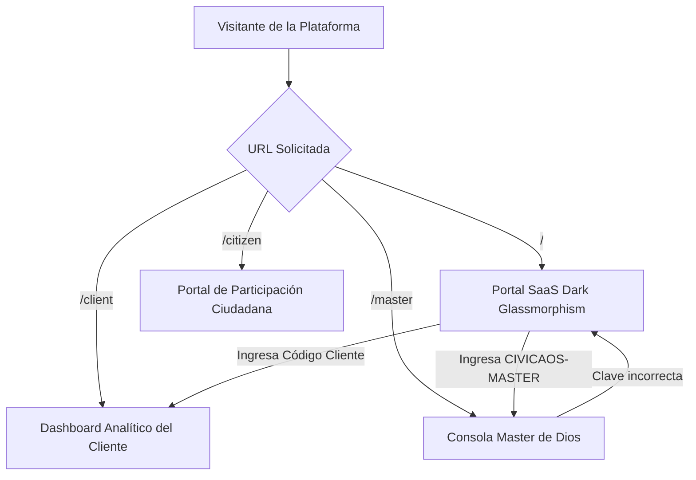

# 📖 CívicaOS Engine - Developer & Architecture Design Document (DD)

Este documento sirve como el mapa definitivo de arquitectura, flujos de datos, reglas de negocio y enrutamiento del ecosistema **CívicaOS Engine**. Su propósito es otorgar contexto inmediato y absoluto a cualquier desarrollador humano o Inteligencia Artificial (IA) que colabore en este repositorio.

---

## 🚀 1. Visión General del Sistema
**CívicaOS Engine** es una plataforma unificada de simulación sociológica de alta fidelidad, gemelos digitales de gobernanza y orquestación de swarms cognitivos de IA. Permite aprovisionar sub-sitios de marca blanca con estilos visuales personalizados (para candidatos o gobiernos municipales) a la par de proveer un canal de ingesta seguro y anónimo para capturar demandas y propuestas ciudadanas.

---

## 🧭 2. Sistema de Enrutamiento y Segregación de Roles

La aplicación utiliza un enrutador basado en el estándar **HTML5 History API** (`window.location.pathname` y `window.history.pushState`). Esto permite tener URLs independientes y limpias que separan de forma estrical los entornos de datos:



### 👤 Los Tres Mundos Segregados:

1.  **El Ciudadano (`/citizen` o `/ciudadano`)**
    *   **Propósito**: Ingesta pública de propuestas.
    *   **Acceso**: Libre, directo, sin claves.
    *   **Visualización**: Pantalla completa del módulo **ThothAgora**, sin barra de navegación lateral ni acceso a métricas analíticas. Garantiza privacidad absoluta.
2.  **El Cliente (`/client`)**
    *   **Propósito**: Tablero ejecutivo de analítica predictiva del candidato o municipio.
    *   **Acceso**: Código de marca blanca único (ej. `HER-DIS-08`, `MORENA-SONORA-2026`).
    *   **Visualización**: Acceso exclusivo a los indicadores ejecutivos, mapas de calor GIS de dolores y simuladores. **Tiene estrictamente prohibido** visualizar analíticas master de cobro o consolas de agentes. Tampoco muestra la pestaña de captura ThothAgora.
3.  **El Administrador Master (`/master` o `/admin`)**
    *   **Propósito**: Control total del ecosistema (Deity Mode).
    *   **Acceso**: Código maestro de seguridad: **`CIVICAOS-MASTER`**.
    *   **Visualización**: Aprovisionamiento de clientes, inyección de temas visuales de marca blanca, métricas SaaS de cobros de API y logs interactivos del orquestador Swarm OpenClaw.

---

## 📂 3. Mapa de Archivos del Proyecto

El proyecto está estructurado como una aplicación moderna SPA basada en **React + Vite** en el frontend, y un servidor unificado en **Python** en el backend:

```text
/
├── src/
│   ├── App.jsx                     # Enrutador principal, compuertas de autenticación y wrapper global
│   ├── index.css                   # Diseño base: tokens CSS, Dark Glassmorphism y keyframes de animación
│   ├── themeManager.js             # Gestor dinámico de CSS custom properties para las 10 marcas blancas
│   ├── models/
│   │   └── dataModel.js            # Modelos matemáticos de simulación de opinión (HK) y predictor Monte Carlo
│   ├── components/
│   │   ├── MasterConsole.jsx       # Interfaz Super-Admin, provisionamiento, billing y consola OpenClaw Swarm
│   │   ├── ThothAgoraPortal.jsx    # Portal de ingesta ciudadana con CURP y firmas criptográficas SHA-256
│   │   ├── DashboardOverview.jsx   # Resumen ejecutivo privado para visualización de KPIs de clientes
│   │   ├── PainPointsMap.jsx       # Mapa interactivo GIS de dolores ciudadanos
│   │   ├── ABMSimulator.jsx        # Sandbox matemático interactivo con sliders de políticas públicas
│   │   └── PredictorEngine.jsx     # Comparador electoral head-to-head de candidatos
├── simulation/
│   ├── api_server.py               # Servidor unificado: sirve estáticos (con SPA Fallback) y endpoints API
│   ├── abm_models.py               # Modelo matemático de opinión Hegselmann-Krause
│   └── agent_swarm.py              # Orquestador del swarm multimodelo cognitivo de Ollama
├── dist/                           # Directorio autogenerado con el empaquetado de producción de Vite
├── deploy_ubuntu.sh                # Script Bash automatizado para despliegue en Ubuntu/VPS
└── DEVELOPER_DOCUMENTATION.md      # Este documento de contexto
```

---

## 🎨 4. Ecosistema de Marca Blanca (10 Plantillas Premium)

El archivo [themeManager.js](file:///Volumes/SSD1TB/plataforma/src/themeManager.js) contiene la inyección en caliente de variables CSS. Llama a `applyTheme(themeId)` en el DOM (`document.documentElement`), lo que altera instantáneamente colores, tipografía, bordes y brillos neón.

### Listado de Temas de Marca Blanca:
1.  **`glass-classic`**: Cristal esmerilado gótico con acentos morados y azules (diseño premium original).
2.  **`cyber-neon`**: Ciberpunk brillante con cian, fucsia y verde neón.
3.  **`royal-corporate`**: Azul ejecutivo profundo combinado con destellos de oro clásico.
4.  **`emerald-eco`**: Colores verdes menta y esmeralda dedicados a la sustentabilidad y medio ambiente.
5.  **`sunset-gold`**: Naranjas profundos y amarillos atardecer para campañas de gran calidez humana.
6.  **`midnight-minimal`**: Escala de grises ultra-limpia y pura con acentos minimalistas en blanco.
7.  **`crimson-cyber`**: Acentos rojo neón y carbón industrial para un toque tecnológico y disruptivo.
8.  **`aero-frosted-light`**: Un espectacular modo claro cristalizado con fondos translúcidos y acentos celestes.
9.  **`quantum-indigo`**: Violetas cuánticos y azules profundos que proyectan ciencia y tecnología de datos.
10. **`nordic-slate`**: Azules acero y grises árticos inspirados en el minimalismo nórdico.

---

## 🔢 5. Modelos Matemáticos y Datos

### A. Simulación sociológica basada en agentes (ABM)
El sandbox utiliza una implementación interactiva del modelo **Hegselmann-Krause (HK)** de confianza acotada. Los agentes sintéticos interactúan e influyen mutuamente si la distancia de sus opiniones es menor que un umbral de tolerancia ($\epsilon$ o épsilon).
*   **sliders en UI**:
    *   *Subsidio de Transporte*: Reduce el dolor de movilidad de los agentes.
    *   *Inversión en Agua*: Aumenta la felicidad promedio de los distritos afectados.
    *   *Seguridad*: Disminuye la dispersión de opiniones de inconformidad.

### B. Ingesta Ciudadana Segura (CURP)
El componente **ThothAgora** captura CURP, CP, Teléfono y opinión. 
*   **Regla de Privacidad**: El sistema obscura la CURP a formato seguro (`XXXX************XX`).
*   **Firma Holográfica**: Combina los datos de ingesta con una sal criptográfica local y genera una firma en SHA-256 única que representa el Gemelo Digital Digitalizado de la demanda.

---

## 🚀 6. Despliegue en la Nube (VPS IP: 144.24.23.61)

El despliegue se realiza de forma automatizada mediante una sincronización bidireccional local-nube:

### Comandos de Sincronización y Lanzamiento (Copiar y Pegar):

1.  **Sincronizar fuentes locales al servidor VPS remoto**:
    ```bash
    rsync -av --delete -e 'ssh -i "/Volumes/SSD1TB/plataforma/Claves SSH/ssh-key-2026-03-21-2.key"' --exclude 'node_modules' --exclude '.git' /Volumes/SSD1TB/plataforma/ ubuntu@144.24.23.61:/home/ubuntu/plataforma/
    ```

2.  **Ejecutar el instalador y relanzar servicios en el VPS**:
    ```bash
    ssh -i "/Volumes/SSD1TB/plataforma/Claves SSH/ssh-key-2026-03-21-2.key" ubuntu@144.24.23.61 "sudo mkdir -p /opt/plataforma && sudo rsync -av --delete /home/ubuntu/plataforma/ /opt/plataforma/ && sudo sed -i 's/\r$//' /opt/plataforma/deploy_ubuntu.sh && sudo chmod +x /opt/plataforma/*.sh && echo '=== INICIANDO DESPLIEGUE ===' && sudo bash /opt/plataforma/deploy_ubuntu.sh"
    ```

---

*Última Actualización de Arquitectura: Mayo de 2026. Todos los sistemas e integraciones se encuentran activos, validados y estables.*
