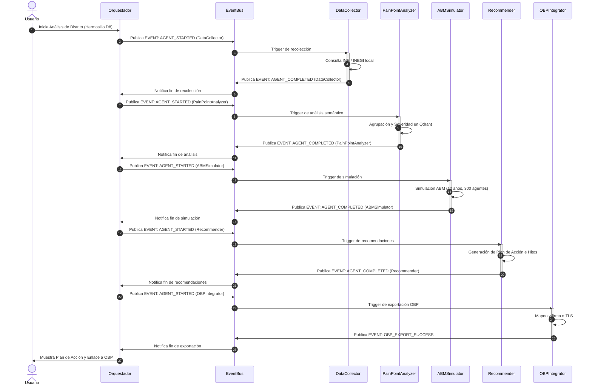
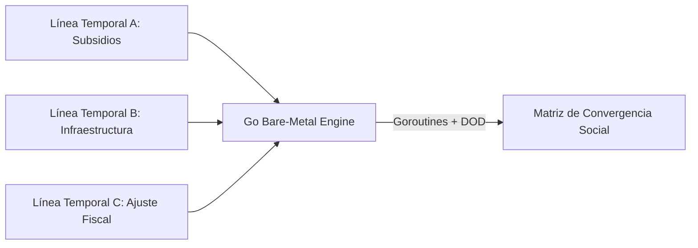

# ADD - Documento de Diseño de Arquitectura (Architecture Design Document)
## CívicaOS: Sistema de Inteligencia Cívica Multi-Nivel

**Versión:** 1.0.0  
**Fecha:** 2026-05-18  
**Autor:** Antigravity Agent  
**Estado:** Especificación Oficial  

---

## 1. Arquitectura de Referencia de CívicaOS

CívicaOS está diseñado bajo los principios de la **Arquitectura Limpia (Clean Architecture)** y la **Arquitectura Hexagonal (Puertos y Adaptadores)**. Esta aproximación garantiza un desacoplamiento estricto entre las reglas de negocio (el dominio de inteligencia cívica), los casos de uso (orquestación del swarm y simulaciones) y los detalles de infraestructura (bases de datos, APIs de INE/INEGI y modelos de IA ejecutados localmente en Ollama).

El sistema opera de forma local (*offline-first*) para garantizar la privacidad absoluta de los datos de comportamiento social y electoral, procesando y orquestando tareas a través de un Swarm Multi-Agente coordinado de manera asíncrona.

```mermaid
graph TD
    subgraph Capa de Presentación (React + TailwindCSS)
        UI[Consola del Orquestador]
        MapView[PainPointsMap - Leaflet]
        ABMView[ABMSimulator - Recharts]
        PredView[PredictorEngine - Recharts]
    end

    subgraph Capa de Aplicación (Orquestador de Swarm)
        Orch[Orquestador Central]
        EventBus[EventBus Asíncrono]
    end

    subgraph Capa de Dominio (Domain Core)
        Entities[Entidades: PainPoint, Candidate, GeographicEntity]
        Aggregates[Agregados: Simulation, TrajectoryPoint]
        Services[Servicios: PainPointAnalysis, ElectoralPrediction]
    end

    subgraph Capa de Infraestructura (Adaptadores)
        Postgres[PostgreSQL + pgvector]
        Qdrant[Qdrant Vector DB]
        DuckDB[DuckDB - Motor OLAP Parquet]
        Ollama[Ollama - Inferencia Local Qwen/DeepSeek]
        OBPApi[Adaptador API Open Business Plan]
    end

    UI --> Orch
    Orch --> EventBus
    Orch --> Entities
    Orch --> Services
    Entities --> Postgres
    Services --> DuckDB
    Services --> Qdrant
    Orch --> Ollama
    Orch --> OBPApi
```

---

## 2. Patrones Arquitectónicos Centrales

Para resolver las altas exigencias de análisis y simulación de CívicaOS, se implementan cuatro patrones arquitectónicos fundamentales:

### 2.1 CQRS (Command Query Responsibility Segregation)
El sistema separa las operaciones de escritura y actualización de estado (comandos) de las operaciones de consulta analítica de alto volumen (consultas). 
* **Escritura (Write Path):** Los registros de auditoría local, la actualización de intensidades de puntos de dolor y las interacciones de los usuarios se escriben en **PostgreSQL**.
* **Lectura/Analítica (Read Path):** Las simulaciones del motor ABM con miles de agentes sintéticos y el histórico censal del INEGI se procesan mediante **DuckDB**, leyendo de archivos parquet de alto rendimiento optimizados para almacenamiento columnar.

### 2.2 Puertos y Adaptadores (Arquitectura Hexagonal)
Para evitar que las APIs externas (INE, INEGI) o la plataforma externa **Open Business Plan (OBP)** dicten la estructura de datos interna de CívicaOS, se definen puertos claros de interfaz:
* `IElectoralDataPort`: Define cómo solicitar históricos y resultados electorales de distritos de México.
* `IDemographicDataPort`: Define la obtención de variables socioeconómicas y poblacionales.
* `IProjectExportPort`: Define la salida estructurada de iniciativas y roadmaps hacia OBP.
Los adaptadores de infraestructura implementan estos puertos y mapean los payloads crudos recibidos a las entidades del dominio de CívicaOS.

### 2.3 Orquestación Multi-Agente Asíncrona (Swarm Orchestration)
En lugar de una ejecución lineal monolítica, CívicaOS utiliza un Swarm de agentes especializados coordinados por un Orquestador Central. La comunicación es reactiva y se maneja mediante eventos a través del `EventBus` local. Los agentes involucrados son:
1. **DataCollector Agent:** Sincroniza datos censales y electorales de distritos específicos (como Palo Verde o Bugambilias en Hermosillo).
2. **PainPointAnalyzer Agent:** Procesa y clasifica textos, encuestas y datos agregados para identificar problemas sociales (crisis de agua, inseguridad, transporte).
3. **ABM Simulator Agent:** Ejecuta modelos basados en agentes utilizando la población sintética.
4. **Recommendation Generator Agent:** Traduce los resultados de simulaciones en planes de mitigación prácticos y roadmaps temporales.
5. **OBP Integrator Agent:** Conecta y exporta el roadmap al formato nativo de Open Business Plan.

### 2.4 Gobernanza y Seguridad Local (mTLS y Auditoría Criptográfica)
Debido a la sensibilidad de la analítica política y los datos ciudadanos, la arquitectura prohíbe el envío de telemetría a servidores en la nube sin cifrado.
* **mTLS Local (Mutual TLS):** La comunicación con contenedores de Ollama o con la API local de Open Business Plan se realiza a través de túneles TLS mutuos que exigen certificados válidos en ambos extremos.
* **Auditoría Criptográfica:** Cada cambio de estado de un agente o evento crítico de orquestación genera un registro de auditoría local (`local-audit.ts`) que es firmado criptográficamente mediante SHA-256 concatenado (Hash-Chain), garantizando que las simulaciones e informes no puedan ser manipulados retroactivamente.

---

## 3. Vista de Datos y Almacenamiento

El almacenamiento de CívicaOS está optimizado para tres tipos de cargas de trabajo: transaccional, semántica y analítica masiva.

| Tecnología | Rol en la Arquitectura | Justificación y Criterio Técnico |
|------------|------------------------|----------------------------------|
| **PostgreSQL + pgvector** | Almacén de Estado Transaccional y Entidades | Almacena las entidades clave (`PainPoint`, `GeographicEntity`, `Candidate`) y sus metadatos. La extensión `pgvector` permite realizar búsquedas de similitud para relacionar perfiles de candidatos con las demandas locales de manera rápida. |
| **Qdrant** | Almacén de Vectores Semánticos | Indexación de embeddings de alta velocidad (generados por el modelo BGE-M3 local). Se utiliza para la desduplicación de reportes de puntos de dolor y agrupación semántica de quejas ciudadanas en categorías. |
| **DuckDB + Parquet** | Motor de Análisis OLAP de Alto Rendimiento | Carga y procesa históricos censales del INEGI y bases de datos del INE. Permite que el motor de simulación ABM realice consultas masivas sobre cientos de miles de agentes sintéticos y sus trayectorias temporales en milisegundos sin sobrecargar PostgreSQL. |

---

## 4. Orquestación del Swarm de Agentes

El flujo de ejecución de la consola del orquestador sigue un ciclo de vida reactivo en el que cada agente publica su progreso y depende del evento de finalización del agente anterior.



---

## 5. Infraestructura y Entornos de Despliegue

CívicaOS se despliega bajo dos modelos de infraestructura adaptados a la capacidad del cliente:

### 5.1 Despliegue Local "Tier 1" (Estación de Inteligencia Offline)
Diseñado para operaciones en campo o ayuntamientos con restricciones estrictas de conectividad a internet.
* **Host Físico:** Apple Silicon Mac Mini M4 (24GB de RAM mínimo) o estación Linux con GPU NVIDIA (RTX 4060 o superior).
* **Contenedores (Docker Compose):**
  * `civicpulse-ui`: Aplicación web React expuesta localmente.
  * `ollama-local`: Servicio local ejecutando Qwen 2.5 72B (cuantizado Q4) y BGE-M3 para embeddings con aceleración por GPU/NPU.
  * `postgres-db`: Base de datos PostgreSQL con `pgvector`.
  * `qdrant-server`: Base de datos vectorial ligera.
### 5.3 Despliegue Bare-Metal Híbrido (Go + MariaDB / SQLite Embebido)
Diseñado para máximo rendimiento computacional en VPS y ejecutables locales autónomos.
* **Motor de Simulación (`civicaos-engine-go`):** Servicio binario estático compilado en Go con arquitectura Data-Oriented Design (DOD).
* **Almacenamiento VPS:** MariaDB (100% Open-Source GPLv2).
* **Almacenamiento Local Desktop:** SQLite / DuckDB embebido en el binario sin requerir servicios externos instalados.

---

## 6. Motor Multiverso y Simulación Paralela Bare-Metal (`civicaos-engine-go`)

El subsistema de exploración multiverso (*Doctor Strange Monte Carlo Engine / Emergence World Simulator*) permite evaluar millones de líneas temporales de políticas públicas en paralelo.



1. **Paralelismo Masivo:** Ejecución asíncrona de simulaciones concurrentes mediante `goroutines` ligeras.
2. **Memoria Contigua (Zero-Allocation):** Los 1024 parámetros por agente sintético se estructuran en arreglos planos (`Structure of Arrays`) para eliminar *cache misses* en la CPU L1/L2/L3.
3. **Distribución Autónoma:** Compilación directa a binarios nativos independientes para macOS (`.app`), Windows (`.exe`) y Linux VPS.

---

*Documento ADD actualizado: 2026-07-29*  
*Próxima revisión programada: 2026-08-29*  

