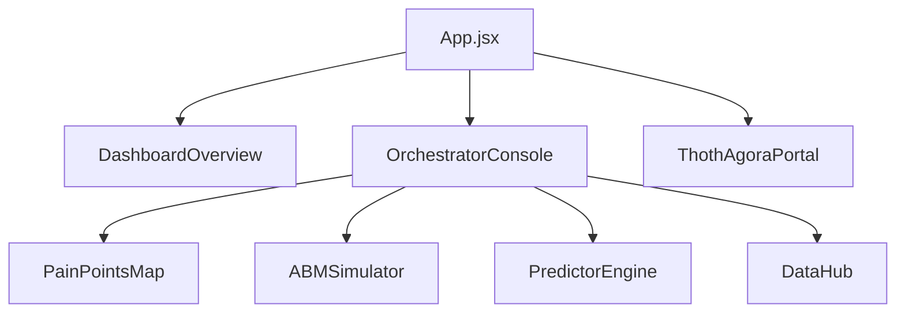

# CDD - Especificación de Desarrollo Dirigido por Componentes (Component-Driven Development)
## CívicaOS: Sistema de Inteligencia Cívica Multi-Nivel

**Versión:** 1.0.0  
**Fecha:** 2026-05-18  
**Autor:** Antigravity Agent  
**Estado:** Especificación Oficial  

---

## 1. Filosofía CDD en CívicaOS

El desarrollo de la interfaz de usuario en CívicaOS sigue la metodología de **Desarrollo Dirigido por Componentes (CDD)**. Este enfoque promueve la construcción de interfaces de usuario "de abajo hacia arriba" (bottom-up), comenzando por componentes atómicos y reutilizables (como botones, inputs y tarjetas translúcidas) antes de ensamblar paneles complejos y consolas de orquestación de nivel superior.

### Principios Fundamentales de CDD:
1. **Desarrollo en Aislamiento:** Los componentes visuales se construyen, documentan y prueban de forma independiente en entornos aislados (como Storybook), asegurando que no dependan de la disponibilidad de bases de datos o servicios de IA externos para renderizarse correctamente.
2. **Consistencia Visual Absoluta:** Todos los componentes comparten un sistema común de diseño, garantizando un aspecto premium y cohesivo (modo oscuro premium, glassmorphism y micro-animaciones).
3. **Mapeo Claro de Responsabilidades:** Cada componente React tiene una única responsabilidad y gestiona su propio estado local o delega el flujo de eventos a través de propiedades (*props*).
4. **Reactividad al Swarm:** Los componentes están optimizados para reaccionar a flujos de datos rápidos provenientes de eventos asíncronos sin causar re-renderizados costosos.

---

## 2. Inventario de Componentes de CívicaOS

A continuación se detalla la especificación de los componentes interactivos del sistema presentes en el directorio `src/components`:



### 2.1 `OrchestratorConsole.jsx`
* **Descripción:** La consola central de control del Swarm. Permite ingresar consultas de análisis libre, observar el registro de logs del Swarm en tiempo real, visualizar el progreso del flujo de orquestación y coordinar las vistas de los agentes especializados.
* **Aislamiento:** Permite inyectar flujos de eventos mockeados para simular ejecuciones completas del Swarm sin necesidad de conectarse a Ollama o PostgreSQL.

### 2.2 `ABMSimulator.jsx`
* **Descripción:** Panel interactivo del simulador basado en agentes (ABM). Proporciona controles deslizantes (sliders) para configurar políticas públicas clave y renderiza gráficos de líneas (Recharts) que muestran la evolución proyectada del bienestar y la opinión pública a lo largo de un horizonte de 10 años.
* **Políticas Controladas:**
  * Subsidio al transporte público (0 - 100)
  * Impuesto comercial local (0 - 100)
  * Presupuesto de seguridad pública (0 - 100)
  * Inversión en infraestructura de agua (0 - 100)

### 2.3 `PainPointsMap.jsx`
* **Descripción:** Mapa interactivo desarrollado con Leaflet y React-Leaflet. Muestra las coordenadas geográficas de los distritos de Hermosillo (`D6_NORTE`, `D8_SUR`, `D9_CENTRO`) coloreadas en una escala cromática que representa el nivel de severidad y el tipo de punto de dolor identificado. Permite hacer drill-down haciendo clic en distritos específicos.

### 2.4 `PredictorEngine.jsx`
* **Descripción:** El motor interactivo de predicción electoral. Renderiza un gráfico de radar comparativo (Recharts) que evalúa el perfil ideológico y de congruencia de los candidatos, junto con un histograma de probabilidad de victoria electoral ajustado por el nivel de felicidad de los agentes del ABM.

### 2.5 `DashboardOverview.jsx`
* **Descripción:** La vista de resumen ejecutivo de la plataforma. Ofrece tarjetas de métricas agregadas de alto impacto visual (KPI Cards) con indicadores de severidad, felicidad promedio de la población, intención de voto y estado de los servicios locales.

### 2.6 `ThothAgoraPortal.jsx`
* **Descripción:** Portal colaborativo y de deliberación ciudadana. Permite simular asambleas digitales donde los agentes del gemelo digital argumentan posiciones y debaten políticas a favor o en contra basándose en sus perfiles ideológicos.

### 2.7 `DataHub.jsx`
* **Descripción:** Panel administrativo para el control e importación de fuentes de datos. Muestra el estado de sincronización y salud de los conectores INE, INEGI y encuestas, y permite disparar actualizaciones manuales de datos en la base transaccional.

---

## 3. Contratos de Componentes (Props y Estado)

Para asegurar la robustez en TypeScript, los componentes clave exponen contratos estrictos de propiedades y estados locales:

| Componente | Propiedades (Props Interface) | Estado Local (State Schema) |
|------------|-------------------------------|-----------------------------|
| **`OrchestratorConsole`** | *Ninguna (Componente de Página Central).* | `query: string`<br>`logs: SwarmEvent[]`<br>`activeAgent: string`<br>`progress: number`<br>`simulationData: any` |
| **`ABMSimulator`** | `initialPolicies: Record<string, number>`<br>`agents: SyntheticAgent[]`<br>`onSimulationComplete: (results: any) => void` | `policies: Record<string, number>`<br>`trajectory: TrajectoryPoint[]`<br>`isSimulating: boolean` |
| **`PainPointsMap`** | `agents: SyntheticAgent[]` | `activeCategory: "TENSION" \| "POLITICAL" \| "SOCIOECONOMIC" \| "CROSSOVER"`<br>`activeLayer: string`<br>`activeSector: string`<br>`dataSourceMode: "SIMULATED" \| "REAL_INGESTED"`<br>`crossoverVarX: string`<br>`crossoverVarY: string`<br>`crossoverMath: "multiply" \| "difference" \| "ratio"`<br>`selectedState: any`<br>`selectedMunicipality: any` |
| **`PredictorEngine`** | `agents: SyntheticAgent[]`<br>`candidateProfiles: any`<br>`onPredict: (results: any) => void` | `predictions: ElectoralPrediction[]`<br>`isCalculating: boolean`<br>`selectedYear: number` |

---

## 4. Micro-Animaciones y Estados de Carga

Para ofrecer una experiencia de usuario altamente inmersiva y premium (*Rich Aesthetics*), los componentes implementan las siguientes interacciones y transiciones fluidas en su CSS / Tailwind:

### 4.1 Spinners e Indicadores de Agentes
Cuando un agente del Swarm está procesando, su icono indicador en la consola realiza una pulsación suave de color (`animate-pulse`) combinada con un anillo giratorio exterior translúcido (`animate-spin`), proporcionando retroalimentación clara sin sobrecargar cognitivamente al usuario.

```css
/* src/index.css - Efecto de Pulsación Premium para Agentes */
.agent-pulse-active {
  animation: pulse-ring 2s cubic-bezier(0.4, 0, 0.6, 1) infinite;
  box-shadow: 0 0 0 4px rgba(16, 185, 129, 0.3);
}

@keyframes pulse-ring {
  0%, 100% {
    opacity: 1;
    transform: scale(1);
  }
  50% {
    opacity: .5;
    transform: scale(1.05);
  }
}
```

### 4.2 Efectos Hover en el Mapa Leaflet
Al pasar el cursor sobre los polígonos de los distritos electorales de Hermosillo, los bordes del polígono aumentan su brillo y su grosor de forma gradual (`transition-all duration-300`), mientras que un panel emergente (Popup) se desliza suavemente desde abajo con un efecto de desenfoque de fondo (*backdrop blur*).

### 4.3 Transición de Gráficos (Recharts)
Los gráficos de Recharts en el simulador ABM y el predictor electoral utilizan curvas de interpolación suave (`monotone`) y transiciones de animación de entrada con un retraso en cascada, permitiendo que las trayectorias de felicidad y los votos de la población sintética "cobren vida" a medida que el usuario ajusta los sliders de políticas públicas en tiempo real.

### 4.4 Glassmorphism Interactivo
Las tarjetas y los paneles superpuestos de la consola utilizan efectos translúcidos premium combinados con un micro-borde brillante que reacciona a la posición del cursor de la siguiente forma:

```css
/* src/index.css - Efecto de Tarjeta Premium de CívicaOS */
.premium-card {
  background: rgba(15, 23, 42, 0.65);
  backdrop-filter: blur(12px);
  -webkit-backdrop-filter: blur(12px);
  border: 1px solid rgba(255, 255, 255, 0.08);
  box-shadow: 0 8px 32px 0 rgba(0, 0, 0, 0.37);
  transition: border-color 0.3s ease, box-shadow 0.3s ease;
}

.premium-card:hover {
  border-color: rgba(16, 185, 129, 0.35);
  box-shadow: 0 8px 32px 0 rgba(16, 185, 129, 0.08);
}
```

---

*Documento CDD actualizado: 2026-05-18*  
*Próxima revisión programada: 2026-06-18*  
