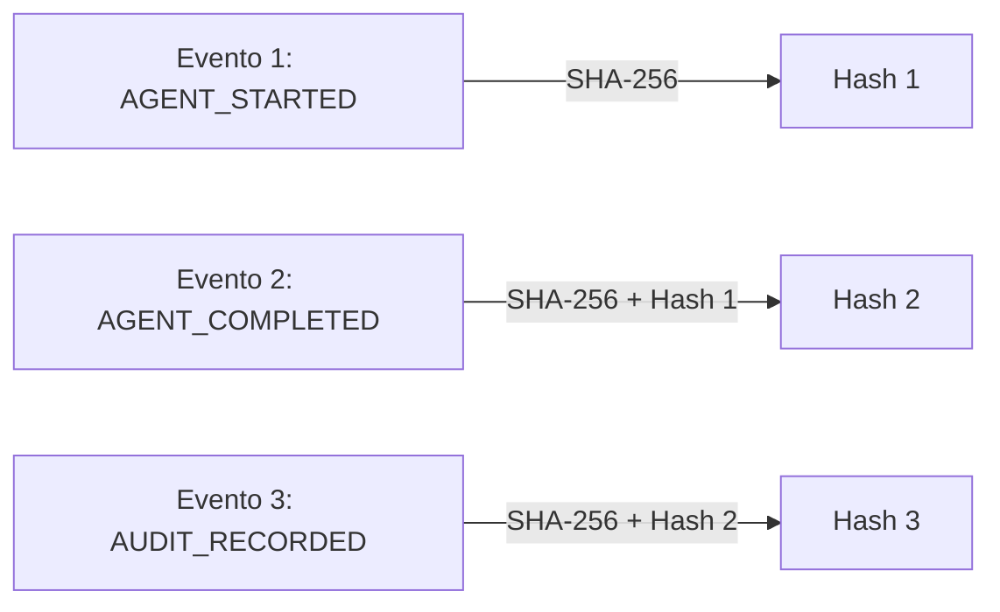

# EDD - Documento de Diseño Orientado a Eventos (Event-Driven Design)
## CívicaOS: Sistema de Inteligencia Cívica Multi-Nivel

**Versión:** 1.0.0  
**Fecha:** 2026-05-18  
**Autor:** Antigravity Agent  
**Estado:** Especificación Oficial  

---

## 1. Fundamentos de EDD en CívicaOS

En CívicaOS, el diseño orientado a eventos (Event-Driven Design o EDD) es el pilar que permite coordinar y desacoplar de forma efectiva el Swarm de Agentes de Inteligencia Artificial. Dado que el procesamiento de inferencias de IA y los cálculos demográficos pesados en DuckDB pueden tomar tiempo variable, la comunicación sincrónica tradicional (bloqueante) degradaría drásticamente la experiencia de usuario y aumentaría el riesgo de fallos en cascada.

### Beneficios Clave del Enfoque EDD:
1. **Desacoplamiento Estricto:** Los agentes de IA y los componentes de presentación no se conocen entre sí; solo producen y consumen eventos a través de un canal centralizado.
2. **Reactividad en Tiempo Real:** La interfaz de usuario (`OrchestratorConsole`) se actualiza inmediatamente a medida que los agentes publican hitos de progreso.
3. **Auditoría e Inmutabilidad:** Cada evento representa un hecho del pasado histórico e inalterable que es capturado por un sistema de auditoría local.
4. **Tolerancia a Fallos y Fallback:** Si un agente de IA falla (por ejemplo, Ollama se apaga), el bus de eventos captura el fallo y dispara de inmediato un agente alternativo sin bloquear el sistema.

---

## 2. Catálogo de Eventos del Swarm

Los eventos en CívicaOS siguen un tipado estricto definido en `src/events/eventTypes.ts`. A continuación se detalla la semántica y estructura de los datos para cada tipo de evento:

| Nombre del Evento | Tipo de Evento | Origen (Publisher) | Descripción y Propósito |
|-------------------|----------------|--------------------|------------------------|
| **Inicio de Agente** | `AGENT_STARTED` | Orquestador / Swarm Engine | Se publica en cuanto un agente (ej. `DataCollector`) es activado para realizar una tarea específica. |
| **Progreso de Agente** | `AGENT_PROGRESS` | Agente Activo | Publica incrementos de progreso (valores de 0 a 1) y logs intermedios para la consola. |
| **Fin de Agente** | `AGENT_COMPLETED` | Agente Activo | Notifica que la tarea del agente ha finalizado con éxito, adjuntando el payload resultante. |
| **Fallo de Agente** | `AGENT_FAILED` | Agente Activo | Indica un error fatal durante la ejecución de la tarea del agente, incluyendo el stack trace o mensaje. |
| **Fin del Swarm** | `SWARM_COMPLETED` | Orquestador | Publicado cuando toda la cadena de agentes ha concluido exitosamente y el informe final está listo. |
| **Registro de Auditoría** | `AUDIT_RECORDED` | Audit System (`local-audit.ts`) | Evento interno que confirma que un hecho ha sido registrado localmente con un hash SHA-256 firmado. |
| **Inicio de Exportación OBP** | `OBP_EXPORT_STARTED` | OBPIntegrator Agent | Se dispara al iniciar la exportación de iniciativas y roadmaps hacia la API local de Open Business Plan. |
| **Éxito de Exportación OBP** | `OBP_EXPORT_SUCCESS` | OBPIntegrator Agent | Confirma la creación del proyecto en OBP y devuelve el ID único y enlace del roadmap. |
| **Fallo de Exportación OBP** | `OBP_EXPORT_FAILURE` | OBPIntegrator Agent | Notifica que la exportación ha fallado por problemas de red o discrepancia de datos. |

### Payload Estructurado del Evento (`SwarmEvent`)
Cada evento publicado tiene la siguiente interfaz tipada en TypeScript:

```typescript
export interface SwarmEvent {
  messageId: string;    // Identificador único UUID del evento
  timestamp: string;    // Fecha en formato ISO 8601 (UTC)
  sender: string;       // Componente u Agente que envía el evento (ej: 'abm-simulator-agent')
  eventType: SwarmEventType; // Tipo de evento (ver tabla anterior)
  payload: {
    agentId?: string;   // Identificador del agente (si aplica)
    message?: string;   // Log explicativo legible por humanos
    progress?: number;  // Valor decimal entre 0 y 1
    error?: string;     // Detalle del error si eventType es AGENT_FAILED
    hash?: string;      // Hash SHA-256 generado por auditoría criptográfica
    data?: any;         // Datos de negocio resultantes (ej: distribución de votos, recomendaciones)
  };
}
```

---

## 3. Implementación del EventBus Local

El núcleo del sistema de eventos es la clase singleton `EventBus` (`src/events/EventBus.ts`). Esta clase actúa como mediador central en el frontend y backend para la publicación y suscripción de eventos.

### Ejemplo de Uso en TypeScript: Suscripción y Publicación

#### 1. Publicación de Progreso de un Agente (Ej: Simulador ABM)
```typescript
import { eventBus } from './events/EventBus';

// Dentro del bucle de simulación del motor ABM
for (let iter = 1; iter <= 10; iter++) {
  // Realizar cálculos
  const progreso = iter / 10;
  
  eventBus.publish({
    sender: 'abm-simulator-agent',
    eventType: 'AGENT_PROGRESS',
    payload: {
      agentId: 'abm-simulator',
      progress: progreso,
      message: `Simulando año ${iter} de trayectoria poblacional en Hermosillo.`
    }
  });
}

// Al completar la simulación
eventBus.publish({
  sender: 'abm-simulator-agent',
  eventType: 'AGENT_COMPLETED',
  payload: {
    agentId: 'abm-simulator',
    progress: 1.0,
    message: 'Simulación ABM finalizada exitosamente.',
    data: {
      trajectory: [{ year: 2026, avgHappiness: 68 }, { year: 2027, avgHappiness: 72 }]
    }
  }
});
```

#### 2. Consumo en la Consola UI de React (Monitoreo)
```typescript
import React, { useEffect, useState } from 'react';
import { eventBus } from '../events/EventBus';
import { SwarmEvent } from '../events/eventTypes';

export const OrchestratorConsole: React.FC = () => {
  const [logs, setLogs] = useState<string[]>([]);
  const [currentProgress, setCurrentProgress] = useState(0);

  useEffect(() => {
    // Escucha todos los eventos del Swarm utilizando el wildcard '*'
    const unsubscribe = eventBus.subscribeAll((event: SwarmEvent) => {
      const timestamp = new Date(event.timestamp).toLocaleTimeString();
      const nuevoLog = `[${timestamp}] [${event.sender}] -> ${event.payload.message}`;
      
      setLogs(prev => [...prev, nuevoLog]);
      
      if (event.payload.progress !== undefined) {
        setCurrentProgress(event.payload.progress * 100);
      }
    });

    return () => unsubscribe(); // Cleanup al desmontar
  }, []);

  return (
    <div className="console-container bg-slate-950 p-4 font-mono text-xs text-emerald-400">
      <div className="progress-bar-container bg-slate-800 h-2 rounded overflow-hidden mb-4">
        <div className="progress-bar bg-emerald-500 h-full transition-all duration-300" style={{ width: `${currentProgress}%` }}></div>
      </div>
      <div className="console-logs max-h-60 overflow-y-auto space-y-1">
        {logs.map((log, index) => (
          <div key={index}>{log}</div>
        ))}
      </div>
    </div>
  );
};
```

---

## 4. Trazabilidad de Auditoría Criptográfica

Debido a que CívicaOS gestiona información de alta sensibilidad política, cada evento relevante es procesado de inmediato por el adaptador `local-audit.ts` para crear una Hash-Chain inalterable.



### Mecanismo de Funcionamiento:
1. El suscriptor de auditoría registra el `SwarmEvent`.
2. Lee el último Hash guardado en la base de datos de auditoría local.
3. Concatena el contenido del nuevo evento con el Hash anterior.
4. Genera un nuevo Hash SHA-256 y lo almacena localmente junto al registro del evento.
5. Si un atacante modificara un solo carácter de una simulación previa en la base de datos, la cadena de hashes se rompería de inmediato, invalidando todo el historial de auditoría de CívicaOS.

---

## 5. Flujo de Eventos Detallado (Caso de Estudio)

A continuación, se presenta la secuencia exacta de eventos generados durante un análisis típico de **Falta de Agua en el Distrito D8 (Hermosillo Sur)**:

1. `[17:38:11] [orchestrator-console] -> AGENT_STARTED`  
   *Payload:* `{ agentId: 'data-collector', message: 'Iniciando recopilación de datos electorales y censales en Distrito 8 (Sur).' }`
2. `[17:38:12] [data-collector-agent] -> AGENT_PROGRESS`  
   *Payload:* `{ progress: 0.5, message: 'Consultando base de datos censal de Palo Verde e históricos del INE.' }`
3. `[17:38:14] [data-collector-agent] -> AGENT_COMPLETED`  
   *Payload:* `{ progress: 1.0, message: 'Datos INE/INEGI mapeados exitosamente.', data: { districtId: 'D8_SUR', averageIncome: 14200, waterAccess: 0.50 } }`
4. `[17:38:14] [orchestrator-console] -> AGENT_STARTED`  
   *Payload:* `{ agentId: 'pain-point-analyzer', message: 'Analizando problemas y agrupando semánticamente denuncias de redes y encuestas.' }`
5. `[17:38:15] [pain-point-analyzer-agent] -> AGENT_PROGRESS`  
   *Payload:* `{ progress: 0.7, message: 'Agrupando reclamos por categorías en la base de datos vectorial Qdrant.' }`
6. `[17:38:16] [pain-point-analyzer-agent] -> AGENT_COMPLETED`  
   *Payload:* `{ progress: 1.0, message: 'Análisis semántico completado.', data: { dominantCategory: 'water', severity: 98, affectedPopulation: 12500 } }`
7. `[17:38:16] [orchestrator-console] -> AGENT_STARTED`  
   *Payload:* `{ agentId: 'abm-simulator', message: 'Inicializando población sintética de 300 agentes y corriendo simulación de 10 años.' }`
8. `[17:38:18] [abm-simulator-agent] -> AGENT_COMPLETED`  
   *Payload:* `{ progress: 1.0, message: 'Simulación finalizada. Proyección hídrica y de intención de voto lista.', data: { votesPercentA: 45.2, votesPercentB: 54.8 } }`
9. `[17:38:19] [orchestrator-console] -> SWARM_COMPLETED`  
   *Payload:* `{ message: 'Análisis de Swarm completado con éxito. Generando panel interactivo de resultados.' }`

---

*Documento EDD actualizado: 2026-05-18*  
*Próxima revisión programada: 2026-06-18*  
