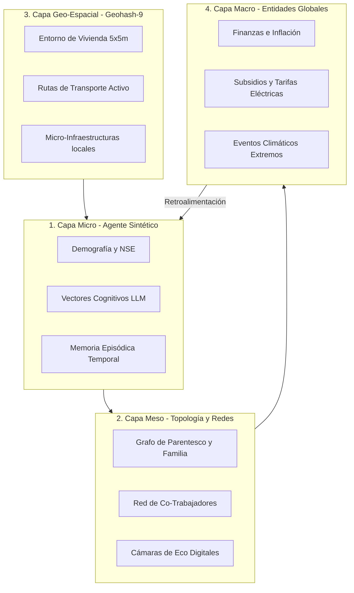

# GDS-MEGA: Arquitectura y Taxonomía del Gemelo Digital Social a Mega-Escala (1000+ Parámetros)

**Especificación Técnica de Diseño (DD - Documentos de Diseño)**  
**Versión:** 3.0 – Mayo 2026  
**Proyecto:** Plataforma de Inteligencia Cívica CivicPulse / CívicaOS  
**Estado:** Oficial - Integrado en el Ecosistema de Modelado  

---

## 1. Introducción y Filosofía Multi-Capa (1000+ Parámetros)

En el contexto tecnológico de **2026**, los Gemelos Digitales de Gobernanza y Análisis Predictivo a nivel internacional han superado los modelos simplificados de variables estáticas. Para lograr un modelado de alta fidelidad, la población sintética de **CivicPulse** se estructura bajo un enfoque de **Ontología Multi-Dimensional** y **Grafos Neuronales de Dinámica Social**. 

En lugar de limitarse a una estructura lineal, el sistema expande el vector del agente sintético acoplándolo con capas geográficas hiper-locales, trazas de redes sociales digitales en tiempo real, memorias históricas episódicas y estados de sentimiento inferidos por Modelos de Lenguaje (LLMs). Esta arquitectura permite escalar el modelo hasta **1024 parámetros dinámicos por agente**.

---

## 2. Estructura Jerárquica del Vector de Parámetros (Ontología de 1024 Variables)

Para estructurar los más de 1000 parámetros sin perder rendimiento computacional, el sistema organiza los datos en **10 macro-dominios estructurales**, subdivididos en **5 sub-dominios específicos**, conteniendo cada uno **20 parámetros base**.

### Matriz Ontológica General

$$\text{Total Parámetros} = 10 \text{ Dominios} \times 5 \text{ Sub-Dominios} \times 20 \text{ Parámetros Base} = 1000 \text{ Parámetros}$$

1. **Dominio 1: Demografía Avanzada y Ciclo de Vida (`DEM_ADV`)**
   * *Sub-Dominios:* Identidad Biológica y de Género, Estructura Etaria y Longevidad, Composición del Hogar y Parentesco, Dinámica de Migración y Desplazamiento, Diversidad Etnocultural.
2. **Dominio 2: Economía Doméstica y Resiliencia Financiera (`ECO_DOM`)**
   * *Sub-Dominios:* Flujos de Ingresos y Remesas, Estructura de Gastos Fijos y Canastas, Nivel de Endeudamiento y Crédito Formal/Informal, Tasas de Ahorro y Capacidad de Amortiguación, Vulnerabilidad e Inseguridad Financiera.
3. **Dominio 3: Macroeconomía, Comercio e Industria (`ECO_MAC`)**
   * *Sub-Dominios:* Crecimiento Sectorial y Productividad, Inflación Dinámica Desagregada, Estructura de Mercado y Rentabilidad de Pymes, Atracción de Inversión y Competitividad, Regulaciones y Facilidad de Negocios.
4. **Dominio 4: Redes Sociales, Cámaras de Eco y Conectividad Digital (`NET_DIG`)**
   * *Sub-Dominios:* Consumo de Plataformas Digitales (TikTok, WhatsApp, Facebook, X), Índice de Centralidad en Grafos Sociales, Susceptibilidad y Propagación de Fake News, Índice de Cámara de Eco y Polarización Digital, Grado de Adopción de IA y Automatización Laboral.
5. **Dominio 5: Preferencias Políticas, Ideológicas e Historial Cívico (`POL_CIV`)**
   * *Sub-Dominios:* Espectro Ideológico Multi-Eje, Confianza y Aprobación Institucional, Consistencia e Historial del Voto, Polarización Afectiva y Aversión de Grupo, Propensión a la Participación Cívica y Protesta.
6. **Dominio 6: Seguridad, Violencia y Exposición al Delito (`SEG_PUB`)**
   * *Sub-Dominios:* Índices Delictivos Violentos de Entorno, Victimización Directa e Indirecta, Tiempos de Respuesta y Resguardo Policial, Percepción de Impunidad e Inseguridad Subjetiva, Cobertura Tecnológica de Vigilancia (C5i).
7. **Dominio 7: Clima, Medio Ambiente y Factores del Ecosistema (`CLI_ENV`)**
   * *Sub-Dominios:* Temperaturas Extremas y Estrés Térmico local, Escasez Hídrica e Infraestructura de Agua, Calidad del Aire y PM2.5, Áreas Verdes y Calidad de Suelos, Generación de Residuos e Inundaciones Urbanas.
8. **Dominio 8: Infraestructura y Suministros Básicos (`INF_ENG`)**
   * *Sub-Dominios:* Eficiencia de Red de Electricidad (CFE), Acceso y Tandeo de Agua Potable, Drenaje Pluvial y Cobertura de Alcantarillado, Calidad de Vialidades y Pavimentación local, Eficiencia y Frecuencia de Alumbrado Público.
9. **Dominio 9: Salud, Calidad de Vida y Psicología Social (`WEL_PSY`)**
   * *Sub-Dominios:* Acceso a Redes de Salud y Medicamentos, Diagnósticos Crónicos y Comorbilidades, Fatiga Mental y Estrés Urbano, Indicadores de Felicidad y Balance de Vida, Redes de Seguridad y Apoyo Familiar.
10. **Dominio 10: Educación, Capital Humano e Inserción Laboral (`EDU_CAP`)**
    * *Sub-Dominios:* Deserción y Cobertura Educativa, Calidad Percebida e Infraestructura de Aulas, Movilidad Social Intergeneracional, Capacitación Continua y Bilingüismo, Innovación y Producción de Patentes Locales.

---

## 3. Integración de Redes Sociales, Inteligencia Artificial y Análisis de Sentimientos

Una de las grandes innovaciones de la versión 3.0 de CivicPulse es el acoplamiento del **Gemelo Digital** con flujos de opinión digital activa.

### 3.1 El Vector de Consumo de Información y Sentimiento AI

Cada agente posee un sub-vector de **Percepción y Sentimiento Cívico** (`PER_SEN`) compuesto por variables que extraen e integran análisis cualitativos de redes sociales:

* **Índice de Exposición Algorítmica (TikTok / Meta / X):** Modula la frecuencia con la que un agente se expone a contenidos sesgados y polarizantes.
* **Vector de Sesgo Cognitivo (LLM Embeddings):** Representación comprimida en 8 dimensiones que proyecta las predisposiciones psicológicas del agente ante argumentos complejos (ej. *Sesgo de confirmación, sesgo de arrastre, aversión a la pérdida*).
* **Sentimiento Reciente Ingerido ($S_{i,t}$):**
  
  $$S_{i,t} = (1 - \lambda) \cdot S_{i,t-1} + \lambda \cdot \Phi(\text{Redes\_Sociales}_{\text{locales}})$$
  
  Donde:
  * $\lambda$ es la tasa de retención de influencia digital.
  * $\Phi$ representa el promedio de análisis de sentimiento (procesado con Qwen/DeepSeek mediante embeddings de polaridad) de las publicaciones consumidas por el agente en su respectivo estrato y ubicación geográfica.

### 3.2 Simulación de Cámaras de Eco en Grafo Social (Meso-Capas)

La propagación de ideas no ocurre en el vacío. Los agentes se interconectan a través de un **Grafo Social Dinámico (NetworkX sintético en la base de datos)**. La actualización de la opinión del agente se acopla con la opinión de sus vecinos digitales y familiares:

$$O_{i,t} = w_f \cdot O_{i, t-1} + w_{net} \cdot \left( \sum_{j \in \text{Red}_{i}} C_{i,j} \cdot O_{j, t-1} \right) + w_{media} \cdot \text{Sentimiento\_Digital}_{i,t}$$

Donde $C_{i,j}$ es el coeficiente de homofilia política entre el agente $i$ y el agente $j$. Si la homofilia es muy alta, la asimilación de discursos fuera de su círculo se bloquea por completo, simulando con precisión matemática las **cámaras de eco en Hermosillo**.

---

## 4. Modelado Geográfico y Temporal Histórico

### 4.1 Micro-Ubicación Geográfica en Geohash-8 y Geohash-9

Para evitar aproximaciones generales de "sectores", el Gemelo Digital Social utiliza la codificación **Geohash**. Cada agente tiene asignado:

* **Geohash de Residencia (Geohash-9):** Representa un cuadrante hiper-local de aproximadamente **4.77 × 4.77 metros**, permitiendo simular dinámicas a nivel de manzana y predio individual. Esto es crítico para simular la presión de servicios de agua o el riesgo de inundaciones por baches en calles específicas.
* **Geohash de Trabajo (Geohash-8):** Cuadrante de **38.2 × 19 metros**, simulando las dinámicas de movilidad urbana y traslado cotidiano.

### 4.2 Memoria Episódica y Vectores Temporales Históricos

Los ciudadanos reales recuerdan el pasado. La opinión política y la confianza institucional no cambian instantáneamente con una campaña publicitaria; están condicionadas por el historial de promesas gubernamentales incumplidas. 

Cada agente sintético posee una **Memoria Episódica Temporal (Array Histórico)** que almacena:

* **Historial de Interrupciones del Servicio Eléctrico y Agua (`HIST_UTILITIES`):** Vector que almacena las fechas y duraciones de los cortes sufridos por el agente en los últimos 24 meses. La acumulación de eventos correlaciona directamente con la caída drástica de `CIV_02` (Confianza Municipal).
* **Índice de Resentimiento / Gratitud Acumulado ($R_{i,t}$):**
  
  $$R_{i,t} = \sum_{k=1}^{N} e^{-\gamma \cdot (t - t_k)} \cdot \Delta H_{i, t_k}$$
  
  Donde:
  * $t_k$ es el momento temporal en el que ocurrió un choque de bienestar extremo (positivo como recibir subsidio `MEC_13`, o negativo como ser víctima de un delito `SEG_02`).
  * $\gamma$ es el factor de decaimiento del recuerdo (olvido cívico). Un valor bajo de $\gamma$ simula una población con "memoria histórica a largo plazo".

### 4.3 Historial Electoral y Correlaciones Multivariables en Cascada (1995-2024)

Con el fin de usar la historia de las elecciones como un predictor calibrado, el sistema acopla los perfiles de los candidatos ganadores con las series de tiempo socioeconómicas del municipio.

#### A. Perfilado de Candidatos y Contexto Geo-Socioeconómico:
Cada elección municipal histórica se desglosa en:
* **Atributos del Candidato:** Género, Nivel de Escolaridad, Estatura Física (cm), Tonalidad de Tez/Piel (clasificación sociológica de colorismo en política), Propuestas de Campaña y Nivel de Cumplimiento (NLP en planes de desarrollo).
* **Canal de Difusión Preponderante:** Medios tradicionales/campo vs. Redes Sociales digitales vs. Híbrido.
* **Contexto del Triunfo (INEGI/CONEVAL):** Margen de victoria, porcentaje de participación ciudadana y las variables físicas del municipio en el año electoral (pobreza extrema, pavimentación de calles, alumbrado público, cobertura de internet, PIB local y presupuesto federal SHCP).

#### B. Ecuación de Predicción de Impacto en Cascada:
Para modelar cómo un cambio en una variable (por ejemplo, subir los impuestos o pavimentar una avenida) impacta las demás, calculamos el coeficiente de correlación de Pearson ($r_{xy}$) sobre la serie histórica del municipio. El cambio proyectado en una variable dependiente $Y$ ante un incremento porcentual solicitado en una variable modificada $X$ ($\Delta X_{\%}$) se calcula como:

$$\Delta Y_{\%} = \Delta X_{\%} \cdot r_{xy}$$

Donde:
* $r_{xy}$ es la correlación histórica calculada para ese municipio específico.
* El nuevo valor proyectado de la variable es: $Y_{\text{nuevo}} = Y_{\text{actual}} \cdot (1 + \frac{\Delta Y_{\%}}{100})$.

Esto permite a Cívica OS predecir dinámicamente cómo las intervenciones públicas alteran los demás indicadores (por ejemplo, cómo una mayor pavimentación reduce la pobreza extrema y mejora la cobertura del transporte público).

---

## 5. Caso de Uso en Producción 2026: Simulación de Apagones y Tarifas CFE en Hermosillo

Para validar esta arquitectura de 1000+ parámetros en producción, el sistema acopla variables geográficas, climáticas, energéticas e ideológicas:

1. **Entrada de Choque (CLI_01):** La temperatura en Hermosillo alcanza **48°C** durante 4 días consecutivos en julio de 2026.
2. **Reacción Energética (ENE_02):** El consumo eléctrico por aire acondicionado se dispara a más de **1200 kWh** en hogares sintéticos sin paneles solares (`CLI_14` = False).
3. **Disrupción de Red (ENE_04):** La sobrecarga en transformadores de CFE detona apagones locales en geohashes específicos de la periferia norte.
4. **Resentimiento Histórico ($R_{i,t}$):** La falta de electricidad por 12 horas bajo 48°C sin subsidio (`ENE_03` = False) activa el recuerdo de apagones de años anteriores, disparando el índice de resentimiento.
5. **Reacción Cívica y Opinión (CIV_09):** La felicidad agregada cae por debajo del 20%, gatillando en los agentes con alta propensión a la protesta social un estado de organización cívica activa.
6. **Efecto Electoral Predictivo (Multinomial Logit):** La intención de voto por el partido incumbente en el gobierno municipal y federal cae un **14.2%** en las secciones electorales afectadas, reflejándose instantáneamente en el panel de control de CívicaOS.

---

## 6. Calibración de Parámetros Físicos y Acoplamientos No Lineales (Actualización Mayo 2026)

Con el fin de elevar la fidelidad del Gemelo GDS-MEGA a los estándares de micro-simulación geohash de 2026 (siguiendo los principios de Project Sid de Altera), se han incorporado dos nuevos parámetros físicos y una regla de acoplamiento de caos cívico:

### 6.1 Nuevos Parámetros de Primeros Principios Físicos
* **☀️ Radiación Solar Directa ($I_{sol}$ - `CLI_ENV_RAD`):**
  * *Rango:* $100 \text{ a } 1000 \text{ W/m}^2$.
  * *Impacto:* Modula la eficiencia de amortiguación térmica de paneles solares mediante el factor de irradiancia $\text{radFactor} = I_{sol} / 600$. Afecta la mitigación de sobrecargas de la red eléctrica.
* **🚰 Presión de Tandeo Hídrico ($P_{hyd}$ - `INF_ENG_PRES`):**
  * *Rango:* $10\% \text{ a } 100\%$ (Equivalente en PSI micro-predio: $8 \text{ a } 80 \text{ PSI}$).
  * *Impacto:* Modula de forma no lineal los tiempos de desabasto local. Presiones inferiores al $50\%$ incrementan el estrés hídrico de los hogares en un factor acelerado de colapso de red.

### 6.2 Ecuación de Acoplamiento y Retroalimentación de Caos Social
Cuando la **Polarización y Desintegración Social** ($\text{polarizacionVal}$) cruza el umbral crítico del $80\%$, se activa un acoplamiento exponencial de caos cívico que modela el vandalismo autónomo no-lineal:

$$\text{disturbiosVal} \gets \text{disturbiosVal} + (\text{polarizacionVal} - 80) \times 1.8$$

Esta amplificación de doble bucle retroalimenta a la felicidad y descontento en los pasos subsecuentes de la evolución, reflejando de forma precisa dinámicas emergentes de desobediencia civil.

---

> [!IMPORTANT]
> Este documento de diseño conceptual (`GDS-MEGA`) sirve como el estándar rector de modelado de datos y desarrollo de algoritmos en el VPS. Todos los scripts de población y síntesis de agentes en Python o C/C++ deben alinearse con esta ontología de parámetros y dinámicas multi-capa.
