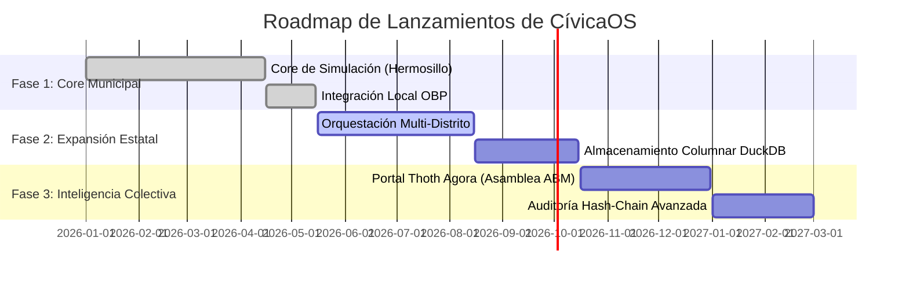

# PDD - Documento de Definición de Producto (Product Design Document)
## CívicaOS: Sistema de Inteligencia Cívica Multi-Nivel

**Versión:** 1.0.0  
**Fecha:** 2026-05-18  
**Autor:** Antigravity Agent  
**Estado:** Especificación Oficial  

---

## 1. Visión y Propósito del Producto

**CívicaOS** es una plataforma interactiva *offline-first* de inteligencia cívica y orquestación multi-agente diseñada para revolucionar la forma en que los gobiernos locales, consultores políticos y estrategas de políticas públicas toman decisiones. La plataforma cierra la brecha histórica entre el análisis cuantitativo de datos sociopolíticos y la formulación ágil de proyectos de inversión pública viables, realistas y financiables.

### El Problema:
* **Decisiones a Ciegas:** Las políticas públicas se diseñan frecuentemente sin herramientas dinámicas de proyección que anticipen efectos secundarios indeseados (como el descontento de un sector de la población o el impacto indirecto en la inflación).
* **Desconexión Técnica:** La información demográfica (del INEGI) y electoral (del INE) existe de forma aislada y dispersa en bases de datos masivas que requieren analistas especializados.
* **Propuestas Inviables:** Las promesas de campaña y planes de gobierno a menudo carecen de una estructura financiera o roadmap de ejecución detallado, quedando como "letra muerta".

### La Solución:
CívicaOS unifica estos mundos en un sistema interactivo local. A través de un **Swarm de Agentes de IA locales (Qwen 2.5 72B / DeepSeek-R1)**, la plataforma recopila y limpia datos públicos, identifica patrones geográficos de dolores ciudadanos, modela el impacto de políticas en un **Gemelo Digital Social (ABM Engine)**, predice probabilidades de éxito electoral y exporta el roadmap resultante directamente a la suite de **Open Business Plan** para convertir propuestas políticas en proyectos de negocio estructurados y viables.

---

## 2. Perfiles de Usuario (User Personas)

### 2.1 Sofía Méndez – Estratega de Políticas Públicas
* **Rol:** Directora de Planeación Municipal de Hermosillo.
* **Necesidades:** Identificar dónde y por qué están ocurriendo las crisis de agua y seguridad en el municipio para justificar y estructurar presupuestos de inversión.
* **Puntos de Dolor:** Falta de datos en tiempo real; los reportes de campo tardan meses y carecen de proyecciones a largo plazo.
* **Cómo usa CívicaOS:** Utiliza la `OrchestratorConsole` y el `PainPointsMap` para visualizar la intensidad del descontento ciudadano en Palo Verde (Distrito 8) y corre simulaciones de inversión en infraestructura hídrica para evaluar el impacto en la felicidad del distrito.

### 2.2 Carlos Ruiz – Científico de Datos Electorales
* **Rol:** Consultor y Analista en Estrategia Política.
* **Necesidades:** Predecir tendencias de intención de voto por distritos electorales específicos basadas en perfiles de candidatos y cambios en la situación socioeconómica de los sectores poblacionales.
* **Puntos de Dolor:** Las encuestas tradicionales son costosas, lentas de realizar y tienen altos márgenes de error debido al sesgo de respuesta.
* **Cómo usa CívicaOS:** Alimenta el `PredictorEngine` con perfiles de candidatos locales e históricos del INE para simular elecciones y determinar qué distritos se comportan como "swing districts" (volátiles) ante cambios en impuestos o subsidios de transporte.

### 2.3 Roberto Celis – Director Ejecutivo de Proyectos (Consultor Tecnológico)
* **Rol:** Enlace entre el análisis estratégico y la formulación ejecutiva.
* **Necesidades:** Traducir las recomendaciones teóricas generadas por el análisis político en roadmaps financieros, planes de contratación y estructuras de negocio listas para presentarse ante inversionistas o cabildos municipales.
* **Puntos de Dolor:** Pérdida de tiempo y errores al transferir información desde reportes en PDF a plantillas de planeación financiera.
* **Cómo usa CívicaOS:** Utiliza la integración nativa mTLS con **Open Business Plan** para exportar la iniciativa cívica aprobada con un solo clic, generando de forma instantánea un roadmap de 3 fases con estimación de presupuestos y métricas (KPIs).

---

## 3. Épicas e Historias de Usuario de Negocio

El desarrollo del producto se organiza en torno a cuatro épicas principales de negocio:

### Épica 1: Consola de Orquestación Inteligente (Swarm AI Console)
* **Historia de Usuario:** Como estratega político, quiero ingresar una consulta libre en lenguaje natural para que un enjambre de agentes de IA locales identifique, estructure y analice los problemas del distrito seleccionado sin requerir conocimientos técnicos complejos.
* **Criterios de Aceptación:**
  * El orquestador debe descomponer la consulta en subtareas asignadas a agentes especializados.
  * Debe renderizar en tiempo real el progreso individual de cada agente y el log completo.
  * El procesamiento debe completarse de forma 100% local a través de Ollama.

### Épica 2: Simulación y Gemelo Digital Social (ABM Engine)
* **Historia de Usuario:** Como analista de políticas públicas, quiero ajustar los presupuestos y niveles de impuestos en sliders interactivos para visualizar cómo evolucionará la felicidad y opinión de diferentes sectores de la población durante los próximos 10 años.
* **Criterios de Aceptación:**
  * La simulación debe utilizar un gemelo digital con un mínimo de 300 agentes sintéticos balanceados demográficamente.
  * Debe reflejar trayectorias anuales diferenciadas para comerciantes, jóvenes y asalariados.
  * Los resultados de la simulación deben ser reproducibles usando una semilla aleatoria fija.

### Épica 3: Predictor de Éxito Electoral
* **Historia de Usuario:** Como consultor de campaña, quiero contrastar perfiles ideológicos de candidatos con la situación actual de los votantes para proyectar el resultado de una elección en Hermosillo y recibir recomendaciones de inversión estratégica.
* **Criterios de Aceptación:**
  * Debe mostrar un radar de perfiles que evalúe dimensiones de economía, seguridad, infraestructura, etc.
  * Las probabilidades finales de victoria deben recalcularse dinámicamente si cambia el estado físico y emocional de los agentes sintéticos.
  * Debe listar los "swing districts" prioritarios con estimaciones de margen de victoria.

### Épica 4: Integración Nativa con Open Business Plan (OBP)
* **Historia de Usuario:** Como director de proyecto, quiero exportar la iniciativa analizada a Open Business Plan para estructurar un plan de negocios ejecutable de manera instantánea y segura.
* **Criterios de Aceptación:**
  * La exportación debe realizarse de forma local y cifrada utilizando mTLS.
  * Debe transferir el roadmap de fases, presupuesto estimado y KPIs.
  * El sistema debe almacenar el ID de proyecto resultante para auditoría y trazabilidad cruzada.

### Épica 5: Simulación Cognitiva Micro a Bajo Costo (SLM Engine)
* **Historia de Usuario:** Como analista de políticas públicas en campo, quiero correr inferencias cognitivas de gemelos sintéticos usando modelos locales extremadamente ligeros (1B/2B parámetros) en mi laptop para evaluar el bienestar individual y la intención de voto de forma gratuita.
* **Criterios de Aceptación:**
  * El motor debe soportar inferencia en tiempo real en Ollama usando `llama3.2:1b` y `qwen2.5:1.5b`.
  * Debe recibir las variables de entrada de temperatura (°C), presión de agua (%) y subsidio de luz ($/kWh).
  * Debe proveer un parser JSON estricto con un algoritmo de fallback heurístico si Ollama está fuera de línea.
  * El gemelo simulado debe devolver su bienestar (1-100), una opinión cognitiva con acento local y su intención de voto.

---

## 4. Roadmap del Producto

El ciclo de desarrollo y lanzamientos de CívicaOS está estructurado en tres grandes fases evolutivas:

* **Fase 1: Core Municipal (Sonora/Hermosillo) - [EN PRODUCCIÓN]:** Implementación del motor de simulación ABM local, mapas de calor distritales con Leaflet, análisis con Ollama y la exportación cifrada local a Open Business Plan.
* **Fase 2: Expansión Estatal y Optimización - [EN DESARROLLO]:** Habilitar el procesamiento analítico OLAP mediante DuckDB + Parquet para manejar simulaciones estatales a gran escala con más de 100,000 agentes sintéticos simultáneos y optimización de memoria.
* **Fase 3: Inteligencia Colectiva y Deliberación - [PLANIFICADO]:** Integración completa de `ThothAgoraPortal.jsx` para recrear asambleas digitales donde los agentes del gemelo debaten e interactúan en tiempo real utilizando aprendizaje por refuerzo, junto con auditoría Hash-Chain completa.

---

## 5. KPIs y Métricas de Éxito de Producto

Para garantizar el retorno de inversión y la excelencia del producto, el equipo evalúa mensualmente las siguientes métricas de rendimiento y negocio:

1. **Tiempo Medio de Respuesta del Swarm (Orchestration Latency):** Tiempo total que toma completar la secuencia completa de agentes. La meta es inferior a 45 segundos para consultas complejas.
2. **Precisión Predictiva (Prediction Accuracy):** Margen de desviación entre las predicciones del modelo electoral y los resultados electorales reales históricos. El estándar mínimo aceptado es de ±4%.
3. **Conversión a Proyectos OBP (OBP Export Rate):** Porcentaje de sesiones de análisis que concluyen exitosamente en un proyecto estructurado y exportado a Open Business Plan. La meta de producto es superior al 70%.
4. **Retención Local (Offline Session Uptime):** Porcentaje de tiempo que la plataforma opera al 100% de capacidades en entornos offline locales Tier 1 sin requerir conexión a internet. La meta de diseño es del 100%.

---

*Documento PDD actualizado: 2026-05-18*  
*Próxima revisión programada: 2026-06-18*  
