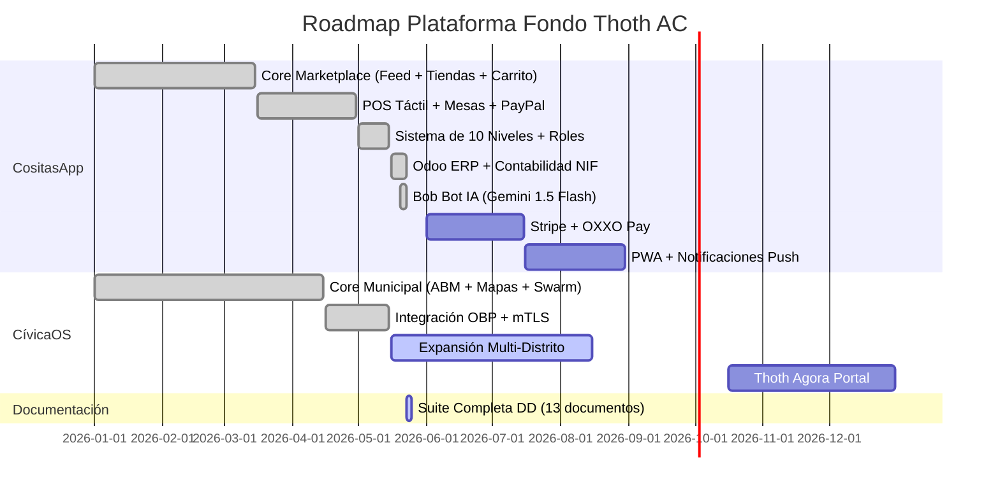

# PRD - Documento de Requisitos del Producto (Product Requirements Document)
## Plataforma Fondo Thoth AC — CositasApp + CívicaOS

**Versión:** 1.0.0  
**Fecha:** 2026-05-23  
**Autor:** Antigravity Agent  
**Estado:** Especificación Oficial  
**Organización:** Fondo Thoth AC (Asociación Civil)  

---

## 1. Resumen Ejecutivo

La **Plataforma Fondo Thoth AC** es un ecosistema digital open-source que integra dos productos principales bajo la estructura legal de una Asociación Civil mexicana:

1. **CositasApp** — Marketplace social multi-nivel con punto de venta (POS), sistema de entregas, contabilidad NIF, integración ERP (Odoo) y asistente de IA (Bob Bot).
2. **CívicaOS** — Plataforma de inteligencia cívica con simulación de gemelos digitales sociales (ABM), predicción electoral y orquestación multi-agente.

Ambos productos comparten infraestructura tecnológica (Firebase, React/Vite, Leaflet) y se gestionan desde un repositorio unificado.

---

## 2. Objetivos del Producto

### 2.1 Objetivos de Negocio
| Objetivo | Métrica Clave | Meta |
|----------|---------------|------|
| Generar ingresos autosustentables para la AC | Ingresos mensuales combinados | $50,000 MXN/mes (Año 1) |
| Digitalizar comercio local en Hermosillo | Comercios registrados | 200+ tiendas activas |
| Crear herramienta de análisis cívico de referencia | Distritos mapeados | 18 distritos de Sonora |
| Establecer modelo replicable open-source | Descargas/forks del repositorio | 100+ en primer año |

### 2.2 Objetivos Técnicos
- Arquitectura modular y desacoplada (Lazy Loading / MoE)
- Funcionamiento offline-first para CívicaOS
- Cumplimiento con NIF mexicanas (B-2, B-3, C-4) en contabilidad
- Integración bidireccional con ERP Odoo vía JSON-RPC
- Soporte para pasarelas de pago (PayPal, Stripe futuro, OXXO Pay futuro)

---

## 3. Productos y Módulos

### 3.1 CositasApp — Marketplace Social Multi-Nivel

#### 3.1.1 Visión del Producto
CositasApp es una plataforma estilo Instagram + Marketplace que permite a cualquier persona emprender desde cero. El sistema desbloquea funcionalidades progresivamente conforme el usuario crece como vendedor, implementando un modelo de 10 niveles con permisos granulares.

#### 3.1.2 Módulos Funcionales

| Módulo | Descripción | Nivel Mínimo |
|--------|-------------|--------------|
| **Feed Social** | Timeline tipo Instagram con publicaciones, likes, comentarios y stories | Nivel 1 (Invitado) |
| **Exploración y Búsqueda** | Navegación de tiendas, productos y categorías con mapa interactivo (Leaflet) | Nivel 1 |
| **Compras y Carrito** | Carrito multi-tienda, checkout con WhatsApp, PayPal y puntos de lealtad | Nivel 2 (Comprador) |
| **Chat y Mensajería** | Chat en tiempo real comprador-vendedor con Firebase Realtime | Nivel 2 |
| **Punto de Venta (POS)** | POS táctil con mesas de restaurante, tickets WhatsApp, múltiples métodos de pago | Nivel 2.5 (Cajero) |
| **Gestión de Inventario** | Control de stock, alertas de reabastecimiento, valuación NIF C-4 | Nivel 2.6 (Almacenista) |
| **Entregas y Logística** | Dashboard de repartidor con mapa en vivo, asignación de pedidos, rutas | Nivel 2.8 (Repartidor) |
| **Venta Ocasional** | Publicación de productos individuales sin tienda formal | Nivel 3 (Vendedor Ocasional) |
| **Tienda Independiente** | Dashboard completo de ventas, POS, inventario y compras B2B | Nivel 4 (Vendedor Independiente) |
| **Contabilidad NIF** | Estado de Resultados (B-3), Flujos de Efectivo (B-2), cálculo de impuestos | Nivel 5 (Vendedor Grande) |
| **Proveedor B2B** | Catálogo mayorista, precios escalonados, gestión de distribuidores | Nivel 6 (Proveedor) |
| **Panel de Administración** | Gestión global de usuarios, estadísticas, configuración de plataforma | Nivel 7 (Administrador) |
| **Bob Bot (IA)** | Asistente inteligente con Gemini 1.5 Flash API o fallback algorítmico local | Nivel 3+ |
| **Soporte Técnico** | Dashboard de tickets, resolución de incidencias | Nivel 7 |
| **Odoo ERP** | Sincronización bidireccional de catálogo, órdenes y facturas con Odoo | Nivel 4+ |

#### 3.1.3 Matriz de Permisos por Nivel

```
┌─────┬──────────────────────┬─────┬──────┬─────┬────────┬───────────┬──────┬─────────┬────────┬──────────┬───────┐
│ Niv │ Nombre               │ Buy │ Chat │ POS │ Deliv  │ Inventory │ Sell │ B2B Buy │ Taxes  │ B2B Sell │ Admin │
├─────┼──────────────────────┼─────┼──────┼─────┼────────┼───────────┼──────┼─────────┼────────┼──────────┼───────┤
│  1  │ Invitado             │  ✗  │  ✗   │  ✗  │   ✗    │     ✗     │  ✗   │    ✗    │   ✗    │    ✗     │   ✗   │
│  2  │ Comprador            │  ✓  │  ✓   │  ✗  │   ✗    │     ✗     │  ✗   │    ✗    │   ✗    │    ✗     │   ✗   │
│ 2.5 │ Cajero POS           │  ✗  │  ✗   │  ✓  │   ✗    │     ✗     │  ✓   │    ✗    │   ✗    │    ✗     │   ✗   │
│ 2.6 │ Almacenista          │  ✗  │  ✓   │  ✗  │   ✗    │     ✓     │  ✗   │    ✗    │   ✗    │    ✗     │   ✗   │
│ 2.8 │ Repartidor           │  ✗  │  ✓   │  ✗  │   ✓    │     ✗     │  ✗   │    ✗    │   ✗    │    ✗     │   ✗   │
│  3  │ Vendedor Ocasional   │  ✓  │  ✓   │  ✗  │   ✗    │     ✗     │  ✓   │    ✗    │   ✗    │    ✗     │   ✗   │
│  4  │ Vendedor Independ.   │  ✓  │  ✓   │  ✓  │   ✗    │     ✓     │  ✓   │    ✓    │   ✗    │    ✗     │   ✗   │
│  5  │ Vendedor Grande      │  ✓  │  ✓   │  ✓  │   ✗    │     ✓     │  ✓   │    ✓    │   ✓    │    ✗     │   ✗   │
│  6  │ Proveedor B2B        │  ✓  │  ✓   │  ✓  │   ✓    │     ✓     │  ✓   │    ✓    │   ✓    │    ✓     │   ✗   │
│  7  │ Administrador        │  ✓  │  ✓   │  ✓  │   ✓    │     ✓     │  ✓   │    ✓    │   ✓    │    ✓     │   ✓   │
└─────┴──────────────────────┴─────┴──────┴─────┴────────┴───────────┴──────┴─────────┴────────┴──────────┴───────┘
```

### 3.2 CívicaOS — Inteligencia Cívica Multi-Agente

#### 3.2.1 Visión del Producto
CívicaOS es una plataforma offline-first de inteligencia cívica que utiliza un Swarm de agentes de IA locales (Qwen 2.5 / DeepSeek-R1) para analizar datos electorales (INE) y censales (INEGI), simular políticas públicas en un Gemelo Digital Social, y exportar roadmaps ejecutivos a Open Business Plan.

#### 3.2.2 Módulos Funcionales
| Módulo | Descripción |
|--------|-------------|
| **Consola del Orquestador** | Interfaz de consulta libre que coordina el Swarm multi-agente |
| **Mapa de Calor (PainPointsMap)** | Visualización geográfica multinivel de problemas ciudadanos con Leaflet |
| **Simulador ABM** | Motor de simulación basado en agentes con gemelo digital social |
| **Predictor Electoral** | Predicción de intención de voto con intervalos de confianza |
| **Thoth Agora Portal** | Asambleas digitales de agentes sintéticos |
| **DataHub** | Panel de sincronización y estado de fuentes de datos externas |

---

## 4. Requisitos Funcionales

### 4.1 RF — CositasApp

| ID | Requisito | Prioridad | Estado |
|----|-----------|-----------|--------|
| RF-CS-001 | El sistema debe permitir registro e inicio de sesión con Email/Password y Google Sign-In vía Firebase Auth | Alta | ✅ Implementado |
| RF-CS-002 | El feed social debe mostrar publicaciones con imágenes, texto, likes y comentarios | Alta | ✅ Implementado |
| RF-CS-003 | Los usuarios deben poder crear y gestionar tiendas con nombre, logo, categoría y descripción | Alta | ✅ Implementado |
| RF-CS-004 | El carrito debe soportar productos de múltiples tiendas simultáneamente | Alta | ✅ Implementado |
| RF-CS-005 | El checkout debe enviar confirmación automática por WhatsApp al vendedor | Alta | ✅ Implementado |
| RF-CS-006 | El POS táctil debe soportar gestión de mesas de restaurante (abrir, agregar, cobrar) | Alta | ✅ Implementado |
| RF-CS-007 | El POS debe aceptar pagos en efectivo, tarjeta, puntos de lealtad y PayPal | Alta | ✅ Implementado |
| RF-CS-008 | El sistema debe generar tickets de venta compartibles por WhatsApp | Media | ✅ Implementado |
| RF-CS-009 | El inventario debe calcular valuación bajo NIF C-4 (Costo Promedio Ponderado) | Media | ✅ Implementado |
| RF-CS-010 | La contabilidad debe generar Estado de Resultados conforme NIF B-3 | Media | ✅ Implementado |
| RF-CS-011 | La contabilidad debe generar Estado de Flujos de Efectivo conforme NIF B-2 | Media | ✅ Implementado |
| RF-CS-012 | El sistema debe sincronizar catálogo y órdenes con Odoo ERP vía JSON-RPC | Media | ✅ Implementado |
| RF-CS-013 | Bob Bot debe responder consultas usando Gemini 1.5 Flash con clave API del usuario | Media | ✅ Implementado |
| RF-CS-014 | Bob Bot debe funcionar con motor algorítmico local si no hay clave API configurada | Media | ✅ Implementado |
| RF-CS-015 | El mapa debe mostrar ubicación de tiendas con Leaflet y permitir búsqueda por zona | Alta | ✅ Implementado |
| RF-CS-016 | El dashboard de repartidor debe mostrar pedidos asignados con mapa en vivo | Media | ✅ Implementado |
| RF-CS-017 | El sistema de niveles debe desbloquear funcionalidades según la matriz de 10 niveles | Alta | ✅ Implementado |
| RF-CS-018 | El programa de lealtad debe acumular y canjear puntos en compras | Media | ✅ Implementado |
| RF-CS-019 | Las reseñas y calificaciones con estrellas deben estar disponibles para cada tienda | Media | ✅ Implementado |
| RF-CS-020 | El chat en tiempo real debe funcionar entre compradores y vendedores | Alta | ✅ Implementado |

### 4.2 RF — CívicaOS

| ID | Requisito | Prioridad | Estado |
|----|-----------|-----------|--------|
| RF-CV-001 | El orquestador debe descomponer consultas en subtareas para agentes especializados | Alta | ✅ Implementado |
| RF-CV-002 | El sistema debe conectar con APIs del INE e INEGI para datos electorales y censales | Alta | ✅ Implementado |
| RF-CV-003 | El motor ABM debe simular poblaciones de 300-10,000 agentes sintéticos | Alta | ✅ Implementado |
| RF-CV-004 | Los mapas de calor deben visualizar puntos de dolor por distrito con drill-down | Alta | ✅ Implementado |
| RF-CV-005 | El predictor electoral debe generar probabilidades con intervalos de confianza | Alta | ✅ Implementado |
| RF-CV-006 | Las recomendaciones deben exportarse a Open Business Plan vía mTLS | Media | ✅ Implementado |

---

## 5. Requisitos No Funcionales

| ID | Categoría | Requisito | Meta |
|----|-----------|-----------|------|
| RNF-001 | Rendimiento | Tiempo de carga inicial de CositasApp | < 3 segundos |
| RNF-002 | Rendimiento | Respuesta del POS ante cobro | < 500ms |
| RNF-003 | Rendimiento | Simulación ABM de 10,000 agentes | < 30 segundos |
| RNF-004 | Seguridad | Autenticación Firebase con tokens JWT | Obligatorio |
| RNF-005 | Seguridad | Claves API de Gemini almacenadas solo en localStorage | Obligatorio |
| RNF-006 | Seguridad | Comunicación mTLS con Open Business Plan | Obligatorio |
| RNF-007 | Escalabilidad | Soporte para 10,000+ usuarios concurrentes en Firestore | Alta |
| RNF-008 | Disponibilidad | CívicaOS debe operar 100% offline | Alta |
| RNF-009 | Compatibilidad | Responsive design para móvil, tableta y desktop | Alta |
| RNF-010 | Mantenibilidad | Cobertura de pruebas >= 80% en módulos críticos | Media |
| RNF-011 | Cumplimiento | Contabilidad conforme a NIF mexicanas (B-2, B-3, C-4) | Alta |
| RNF-012 | Accesibilidad | WCAG 2.1 nivel AA mínimo | Media |

---

## 6. Arquitectura Tecnológica

### 6.1 Stack de CositasApp
| Capa | Tecnología |
|------|-----------|
| Frontend | React 18 + Vite |
| Estado | Context API (AuthContext, CartContext) |
| Estilos | CSS Vanilla (index.css + App.css) premium oscuro |
| Backend | Firebase (Auth, Firestore, Functions, Hosting) |
| Mapas | Leaflet + React-Leaflet |
| Pagos | PayPal SDK (activo), Stripe (planificado) |
| IA | Gemini 1.5 Flash API (clave del usuario) |
| ERP | Odoo JSON-RPC/XML-RPC |
| Build | Vite con tree-shaking y lazy loading |

### 6.2 Stack de CívicaOS
| Capa | Tecnología |
|------|-----------|
| Frontend | React + TypeScript |
| Backend | Node.js con orquestación de agentes |
| Base de datos | PostgreSQL + pgvector, DuckDB (OLAP) |
| Vectores | Qdrant |
| IA Local | Ollama (Qwen 2.5 72B, DeepSeek-R1, BGE-M3) |
| Mapas | Leaflet con GeoJSON multinivel |
| Exportación | Open Business Plan (mTLS) |

---

## 7. Perfiles de Usuario (Personas)

### 7.1 CositasApp

**Ana García — Compradora**  
Ama de casa de 35 años en Hermosillo que busca productos locales y artesanales cerca de su colonia. Quiere comparar precios, leer reseñas y pagar fácilmente por WhatsApp o PayPal.

**Miguel Torres — Vendedor Independiente (Nivel 4)**  
Emprendedor de 28 años con un negocio de tacos y quesadillas. Usa el POS táctil con mesas, controla su inventario y necesita reportes de contabilidad básica para su contador.

**Sofía Reyes — Proveedora B2B (Nivel 6)**  
Distribuidora de insumos para restaurantes. Maneja catálogos mayoristas, conecta con Odoo para su ERP corporativo y surte a 15 vendedores de la plataforma.

**Carlos López — Repartidor (Nivel 2.8)**  
Joven de 22 años que hace entregas en bicicleta eléctrica. Ve pedidos asignados en el mapa, actualiza estados y cobra comisiones por entrega completada.

### 7.2 CívicaOS
*(Referenciados en PDD.md: Sofía Méndez, Carlos Ruiz, Roberto Celis)*

---

## 8. Modelo de Monetización (AC)

| Canal | Descripción | Ingreso Estimado |
|-------|-------------|------------------|
| Licencias Open-Source con soporte | "Con un donativo de $X recibes licencia de soporte premium" | Variable |
| Comisiones por transacción | 3-5% por venta procesada en la plataforma | % sobre GMV |
| Publicidad contextual | Banners de negocios locales en el feed | CPM |
| Servicios de análisis cívico | Consultoría con CívicaOS para municipios | Por proyecto |
| Crowdsourcing comunitario | Donaciones y campañas de la comunidad | Variable |
| SaaS white-label | Plataforma personalizada para otras ciudades | Mensual |

---

## 9. Roadmap del Producto



---

## 10. Riesgos y Mitigaciones

| Riesgo | Probabilidad | Impacto | Mitigación |
|--------|-------------|---------|------------|
| Rechazo de donataria autorizada por SAT | Alta | Alto | Modelo mixto: 50% ingresos por servicios + 50% donativos |
| Saturación de cuota gratuita de Firebase | Media | Alto | Monitoreo proactivo y escalado a plan Blaze |
| Dependencia de API Gemini gratuita | Media | Medio | Bob Bot tiene fallback algorítmico local sin API |
| Competencia de Rappi/Uber Eats | Alta | Medio | Diferenciación en comercio hiperlocal y comisiones bajas |
| Complejidad de cumplimiento NIF | Media | Alto | Asesoría contable profesional continua |

---

## 11. Criterios de Éxito (KPIs)

| KPI | Meta Q3 2026 | Meta Q4 2026 |
|-----|-------------|-------------|
| Tiendas activas en CositasApp | 50 | 200 |
| Transacciones mensuales | 500 | 2,000 |
| Usuarios registrados | 1,000 | 5,000 |
| Distritos analizados en CívicaOS | 8 | 18 |
| Documentación DD completa | 13/13 ✅ | Mantenida |

---

*Documento PRD creado: 2026-05-23*  
*Próxima revisión programada: 2026-06-23*  
