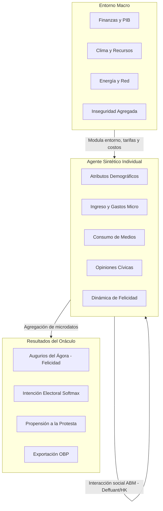
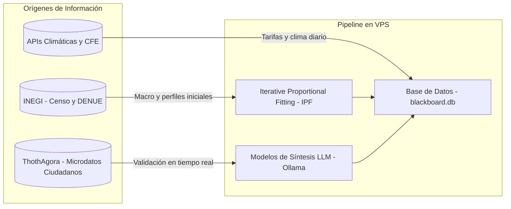

# Especificación del Gemelo Digital Social: Taxonomía Dinámica de 200 Parámetros

Este documento detalla el diseño de modelado y la taxonomía completa de **200 variables y parámetros macro y microeconómicos, demográficos, políticos, energéticos, climáticos y de seguridad** que estructuran el **Gemelo Digital Social (GDS)** de CivicPulse / CívicaOS. 

---

## 1. Visión del Gemelo Digital Social

El **Gemelo Digital Social** es una réplica computacional de la sociedad basada en **Población Sintética** y **Modelado Basado en Agentes (ABM)**. Su propósito principal es simular el impacto dinámico de políticas públicas, fluctuaciones macroeconómicas, crisis climáticas y disrupciones en servicios básicos sobre el bienestar social (felicidad agregada), la opinión pública y la intención electoral en Hermosillo y Sonora.

El motor acopla las variables micro (atributos individuales de los agentes sintéticos) con las variables macro (indicadores agregados y de entorno) para simular dinámicas sociales complejas y emergentes.

---

## 2. Clasificación Taxonómica de los 200 Parámetros

La taxonomía está estructurada en **10 dominios críticos**, cada uno compuesto por **exactamente 20 parámetros** con definiciones formales, tipos de datos y niveles de modelado.

---

### Bloque A: Microeconomía y Economía Familiar (MEC_01 a MEC_20)

Este bloque representa el perfil financiero interno y la resiliencia del hogar sintético del agente.

| ID | Nombre del Factor | Tipo de Dato | Nivel | Descripción y Efecto en la Simulación |
| :--- | :--- | :--- | :--- | :--- |
| **MEC_01** | Ingreso Familiar Mensual | Real `[0.0, 500k.0]` | Micro | Ingreso neto en pesos. Afecta directamente la elasticidad del consumo y felicidad. |
| **MEC_02** | Índice de Endeudamiento | Real `[0.0, 1.0]` | Micro | Relación deuda/ingresos. Modula la resistencia a choques macroeconómicos. |
| **MEC_03** | Tasa de Ahorro Familiar | Real `[0.0, 1.0]` | Micro | Fracción de ingresos no consumida. Aumenta la resiliencia cívica. |
| **MEC_04** | Costo Canasta Alimentaria | Real `[0.0, 50.0k]` | Macro-Col | Costo local de canasta básica. Genera estrés social si supera a MEC_01. |
| **MEC_05** | Gasto en Educación | Real `[0.0, 1.0]` | Micro | Proporción del ingreso invertida en capital humano. |
| **MEC_06** | Gasto en Salud Privada | Real `[0.0, 1.0]` | Micro | Proporción de ingreso por falta de cobertura pública efectiva. |
| **MEC_07** | Propensión al Consumo | Real `[0.0, 1.0]` | Micro | Multiplicador de inyección de recursos directos sobre economía interna. |
| **MEC_08** | Tasa de Empleo Informal | Real `[0.0, 1.0]` | Micro-Seg | Probabilidad de que el agente carezca de seguridad social y contrato. |
| **MEC_09** | Estabilidad Laboral | Real `[0.0, 1.0]` | Micro | Percepción de conservar empleo. Modula confianza en el futuro económico. |
| **MEC_10** | Salario Base de Cotización | Real `[0.0, 100.0k]` | Micro | Salario formal registrado ante el IMSS. Impacta la capacidad crediticia. |
| **MEC_11** | Costo de Alquiler/Hipoteca | Real `[0.0, 1.0]` | Micro | Gasto fijo de vivienda. Reduce el ingreso disponible. |
| **MEC_12** | Dependencia de Remesas | Real `[0.0, 1.0]` | Micro | Fracción del presupuesto dependiente de flujos externos. |
| **MEC_13** | Subsidios Gubernamentales | Real `[0.0, 50.0k]` | Micro | Apoyos directos (Bienestar, becas). Fortalece simpatía política. |
| **MEC_14** | Vulnerabilidad Económica | Real `[0.0, 1.0]` | Micro | Sensibilidad ante imprevistos médicos/climáticos. |
| **MEC_15** | Acceso a Crédito Formal | Real `[0.0, 1.0]` | Micro | Score sintético que evalúa probabilidad de financiamiento bancario. |
| **MEC_16** | Gasto en Recreación | Real `[0.0, 1.0]` | Micro | Gasto en esparcimiento. Relacionado con la felicidad individual. |
| **MEC_17** | Propensión a Emprender | Real `[0.0, 1.0]` | Micro | Tendencia al autoempleo ante desempleo formal o bajos salarios. |
| **MEC_18** | Costo de Transporte Diario | Real `[0.0, 5.0k]` | Micro | Gasto en traslados. Sensible a variaciones en combustibles. |
| **MEC_19** | Precariedad de Vivienda | Real `[0.0, 1.0]` | Micro | Calidad física del hogar. Modula vulnerabilidad ante climas severos. |
| **MEC_20** | Brecha Salarial de Género | Real `[0.0, 1.0]` | Macro-Sec | Asimetría de ingresos en el sector del agente. |

---

### Bloque B: Macroeconomía y Dinámica Financiera (MAC_01 a MAC_20)

Establece las condiciones estructurales del sistema financiero y comercial del entorno.

| ID | Nombre del Factor | Tipo de Dato | Nivel | Descripción y Efecto en la Simulación |
| :--- | :--- | :--- | :--- | :--- |
| **MAC_01** | Crecimiento del PIB Estatal | Real `[-0.2, 0.2]` | Macro | Tasa anualizada. Determina la tasa de generación de empleos formales. |
| **MAC_02** | Tasa de Inflación Anual | Real `[0.0, 1.0]` | Macro | Pérdida de valor adquisitivo agregada. Castiga a agentes con MEC_01 bajo. |
| **MAC_03** | Tasa de Referencia (TIIE) | Real `[0.0, 0.5]` | Macro | Modula tasas de préstamos y propensión al ahorro. |
| **MAC_04** | Tipo de Cambio USD/MXN | Real `[10.0, 35.0]` | Macro | Relevante para zonas fronterizas (Hermosillo). Modula exportación. |
| **MAC_05** | Inversión Extranjera Directa | Real `[0.0, 10.0B]` | Macro | Inyección de capital industrial. Crea empleo calificado regional. |
| **MAC_06** | Eficiencia Fiscal Municipal | Real `[0.0, 1.0]` | Macro | Capacidad del ayuntamiento para cobrar predial/derechos locales. |
| **MAC_07** | Deuda Pública Subnacional | Real `[0.0, 100.0B]` | Macro | Compromiso presupuestal estatal que limita inversión pública. |
| **MAC_08** | Margen de Utilidad del Sector | Real `[0.0, 1.0]` | Macro-Sec | Viabilidad promedio de las empresas del sector del agente. |
| **MAC_09** | Tasa de Desempleo Abierto | Real `[0.0, 1.0]` | Macro | Modula la probabilidad de transición formal-informal del agente. |
| **MAC_10** | Confianza Empresarial | Real `[0.0, 1.0]` | Macro | Determina la intención de expansión industrial y contratación. |
| **MAC_11** | Productividad por Hora | Real `[0.0, 10.0k]` | Macro-Sec | Valor económico agregado por hora laborada por el agente. |
| **MAC_12** | Costo Logístico / Km | Real `[0.0, 1.0]` | Macro | Afecta el precio final de mercancías en Hermosillo. |
| **MAC_13** | Coeficiente Gini Municipal | Real `[0.0, 1.0]` | Macro | Concentración del ingreso. Modula polarización y tensión social. |
| **MAC_14** | Tasa Quiebra de MIPYMEs | Real `[0.0, 1.0]` | Macro | Tasa de disolución anual de pequeños negocios locales. |
| **MAC_15** | Elasticidad-Precio Básicos | Real `[-2.0, 0.0]` | Macro | Grado en que los agentes sustituyen alimentos ante inflación. |
| **MAC_16** | Costo Promedio del Capital | Real `[0.0, 1.0]` | Macro | Tasa de descuento aplicada a proyectos locales (WACC). |
| **MAC_17** | Exportación Manufacturera | Real `[0.0, 100.0B]` | Macro | Fuerza económica de maquiladoras en Sonora. |
| **MAC_18** | Balanza Comercial Interestatal| Real `[-1.0, 1.0]` | Macro | Flujo neto de divisas inter-entidades federativas. |
| **MAC_19** | Doing Business Local | Real `[0.0, 1.0]` | Macro | Agilidad regulatoria municipal para constituir empresas. |
| **MAC_20** | Informalidad Agregada | Real `[0.0, 1.0]` | Macro | Porcentaje del PIB local generado en la informalidad. |

---

### Bloque C: Demografía y Población Sintética (DEM_01 a DEM_20)

Compone el perfil social, etario, residencial y educativo individual de la muestra del gemelo digital.

| ID | Nombre del Factor | Tipo de Dato | Nivel | Descripción y Efecto en la Simulación |
| :--- | :--- | :--- | :--- | :--- |
| **DEM_01** | Edad del Agente | Entero `[18, 100]` | Micro | Edad biológica. Modula comportamiento político y necesidades de salud. |
| **DEM_02** | Género | Enum | Micro | Mapeo biológico e identidad social del agente. |
| **DEM_03** | Escolaridad (Años) | Entero `[0, 24]` | Micro | Años en el sistema formal. Modula tolerancia y adaptabilidad tecnológica. |
| **DEM_04** | Densidad Poblacional Vecindario| Real `[0.0, 50.0k]`| Micro-Geo| Densidad en la zona de vivienda. Modula interacción cara a cara. |
| **DEM_05** | Dependientes Directos | Entero `[0, 15]` | Micro | Número de menores o ancianos bajo cuidado del agente. |
| **DEM_06** | Tasa Natalidad del Estrato | Real `[0.0, 0.1]` | Micro-Seg| Probabilidad de expansión familiar del agente. |
| **DEM_07** | Mortalidad Infantil del Estrato | Real `[0.0, 0.1]` | Macro-Seg| Indicador indirecto de calidad sanitaria regional. |
| **DEM_08** | Esperanza de Vida | Real `[30.0, 95.0]` | Micro-Seg| Expectativa de supervivencia para el perfil demográfico. |
| **DEM_09** | Atracción Migratoria Interna | Real `[-0.1, 0.1]` | Macro | Flujo de personas mexicanas hacia Hermosillo. |
| **DEM_10** | Tasa Emigración Internacional| Real `[0.0, 0.1]` | Macro-Seg| Tendencia de salida a EUA en el sector del agente. |
| **DEM_11** | Cobertura Registro Identidad | Real `[0.0, 1.0]` | Macro | Nivel de posesión de INE sintética válida. |
| **DEM_12** | Tipología de Vivienda | Enum | Micro | Unifamiliar, condominio, asentamiento irregular. |
| **DEM_13** | Tasa Divorcio del Estrato | Real `[0.0, 1.0]` | Micro-Seg| Tasa de separación familiar y necesidad de doble renta. |
| **DEM_14** | Dependencia Demográfica | Real `[0.0, 2.0]` | Macro | Relación retirados/activos. Presiona el gasto público social. |
| **DEM_15** | Condición Crónica de Salud | Boolean | Micro | Presencia de comorbilidad (diabetes, hipertensión en Sonora). |
| **DEM_16** | Nivel Socioeconómico (NSE) | Enum `[A/B, C, D, E]`| Micro | Nivel jerárquico según variables de equipamiento de AMAI. |
| **DEM_17** | Antigüedad Residencial | Entero `[0, 80]` | Micro | Años habitando la misma sección electoral. Modula arraigo vecinal. |
| **DEM_18** | Discapacidad Persistente | Boolean | Micro | Limita movilidad física del agente. Modula accesibilidad vial. |
| **DEM_19** | Auto-adscripción Étnica | Enum | Micro | Reconocimiento de pertenencia a etnias sonorenses (Yaqui, Seri, etc.) |
| **DEM_20** | Alfabetización Digital | Real `[0.0, 1.0]` | Micro | Habilidad para usar herramientas informáticas complejas. |

---

### Bloque D: Preferencias Cívicas, Culturales y Sociales (CIV_01 a CIV_20)

Modela los perfiles psicológicos, afiliaciones, tolerancia y dinámicas de interacción cívica de los ciudadanos.

| ID | Nombre del Factor | Tipo de Dato | Nivel | Descripción y Efecto en la Simulación |
| :--- | :--- | :--- | :--- | :--- |
| **CIV_01** | Espectro Político | Real `[-1.0, 1.0]` | Micro | Proximidad ideológica. Modula su asimilación de discursos oficiales. |
| **CIV_02** | Confianza Gob. Municipal | Real `[0.0, 1.0]` | Micro | Nivel de aceptación del Alcalde de Hermosillo. |
| **CIV_03** | Confianza Gob. Estatal | Real `[0.0, 1.0]` | Micro | Nivel de aceptación del Gobernador de Sonora. |
| **CIV_04** | Confianza Gob. Federal | Real `[0.0, 1.0]` | Micro | Aceptación del Presidente. Modula intención de voto. |
| **CIV_05** | Consumo Medios Masivos | Real `[0.0, 1.0]` | Micro | Exposición a televisión, radio y prensa tradicional. |
| **CIV_06** | Consumo Medios Digitales | Real `[0.0, 1.0]` | Micro | Exposición a redes sociales. Modula la velocidad de opinión. |
| **CIV_07** | Vulnerabilidad a Desinformación| Real `[0.0, 1.0]`| Micro | Susceptibilidad a Fake News. Modula dispersión de pánico social. |
| **CIV_08** | Participación Cívica Activa | Real `[0.0, 1.0]` | Micro | Involucramiento en comités de vecinos o asociaciones civiles. |
| **CIV_09** | Tendencia a Protesta | Real `[0.0, 1.0]` | Micro | Probabilidad de activarse en protestas masivas si felicidad baja. |
| **CIV_10** | Activismo Partidista | Real `[0.0, 1.0]` | Micro | Lealtad y movilización electoral partidista del agente. |
| **CIV_11** | Religiosidad y Culto | Real `[0.0, 1.0]` | Micro | Relevante para evaluar temas valóricos de agenda social. |
| **CIV_12** | Polarización Afectiva | Real `[0.0, 1.0]` | Micro | Aversión a simpatizantes de ideologías políticas contrarias. |
| **CIV_13** | Consistencia de Voto | Real `[0.0, 1.0]` | Micro | Probabilidad de votar por el mismo partido sin importar campañas. |
| **CIV_14** | Capital Social Vecinal | Real `[0.0, 1.0]` | Micro | Grado de ayuda mutua comunitaria en la manzana del agente. |
| **CIV_15** | Tolerancia a la Diversidad | Real `[0.0, 1.0]` | Micro | Apertura ante agendas progresistas o cambios de paradigma social. |
| **CIV_16** | Percepción de Corrupción | Real `[0.0, 1.0]` | Micro | Sensación de malversación gubernamental. Reduce legitimidad tributaria. |
| **CIV_17** | Interés Asuntos Públicos | Real `[0.0, 1.0]` | Micro | Atención del agente a las decisiones del Cabildo de Hermosillo. |
| **CIV_18** | Influencia Familiar | Real `[0.0, 1.0]` | Micro | Peso relativo del hogar en las decisiones electorales del agente. |
| **CIV_19** | Influencia de Red Laboral | Real `[0.0, 1.0]` | Micro | Modulación de opiniones por el círculo laboral inmediato. |
| **CIV_20** | Optimismo de Futuro | Real `[0.0, 1.0]` | Micro | Percepción de que el país/ciudad estará mejor en los próximos años. |

---

### Bloque E: Clima, Medio Ambiente y Resiliencia (CLI_01 a CLI_20)

Sonora posee un clima desértico extremo. Este bloque modela las condiciones ambientales que impactan la economía y salud de los agentes.

| ID | Nombre del Factor | Tipo de Dato | Nivel | Descripción y Efecto en la Simulación |
| :--- | :--- | :--- | :--- | :--- |
| **CLI_01** | Temperatura Media Diaria | Real `[-10.0, 55.0]` | Macro | Clima diario. Determina la urgencia energética en Hermosillo. |
| **CLI_02** | Humedad Relativa | Real `[0.0, 1.0]` | Macro | Impacta el índice de estrés térmico (sensación real). |
| **CLI_03** | Escasez de Agua Potable | Real `[0.0, 1.0]` | Macro | Estado crítico del acuífero y presas locales. Afecta tandeos de agua. |
| **CLI_04** | Olas de Calor Extremo | Entero `[0, 365]` | Macro | Días al año sobre 45°C. Genera picos de mortalidad y consumo eléctrico. |
| **CLI_05** | Calidad del Aire (PM2.5) | Real `[0.0, 500.0]` | Macro-Geo | Contaminación del aire en la zona de vivienda. |
| **CLI_06** | Áreas Verdes per Cápita | Real `[0.0, 100.0]` | Micro-Geo | Metros cuadrados de parque accesibles. Modula estrés de agentes. |
| **CLI_07** | Isla de Calor Urbana | Real `[0.0, 15.0]` | Micro-Geo | Elevación localizada de temperatura por asfalto. |
| **CLI_08** | Precipitación Acumulada | Real `[0.0, 2000.0]` | Macro | Lluvia anual. Si es extrema en Hermosillo, detona inundaciones. |
| **CLI_09** | Huella de Carbono Personal | Real `[0.0, 100.0]` | Micro | Emisiones individuales estimadas del agente. |
| **CLI_10** | Residuos Sólidos Diarios | Real `[0.0, 10.0]` | Micro | Kilogramos de basura doméstica generados al día. |
| **CLI_11** | Eficiencia Recolección Basura| Real `[0.0, 1.0]` | Macro-Geo | Cobertura municipal del servicio de recolección semanal. |
| **CLI_12** | Riesgo de Inundación Local | Real `[0.0, 1.0]` | Micro-Geo | Pendiente y proximidad a arroyos (asentamiento irregular). |
| **CLI_13** | Erosión y Desertificación | Real `[0.0, 1.0]` | Macro | Pérdida de suelo útil en la periferia municipal. |
| **CLI_14** | Adopción de Paneles Solares| Boolean | Micro | Presencia de ecotecnología que disminuye costo de CFE. |
| **CLI_15** | Consumo de Agua por Hogar | Real `[0.0, 5.0k]` | Micro | Consumo diario en litros de la unidad familiar. |
| **CLI_16** | Estrés Térmico Laboral | Real `[0.0, 1.0]` | Micro-Sec | Severidad del clima sobre la jornada del trabajador al aire libre. |
| **CLI_17** | Preocupación Ambiental | Real `[0.0, 1.0]` | Micro | Conciencia ecológica del agente. Modula apoyo a políticas verdes. |
| **CLI_18** | Inversión en Resiliencia | Real `[0.0, 1.0]` | Macro | Presupuesto municipal asignado a mitigación climática. |
| **CLI_19** | Metales Pesados en Agua | Real `[0.0, 10.0]` | Macro-Geo | Niveles detectados de contaminantes químicos en el suministro. |
| **CLI_20** | Costo Social del Carbono | Real `[0.0, 1.0]` | Macro | Impacto económico proyectado del daño ecológico local. |

---

### Bloque F: Energía, Electricidad y Servicios Públicos (ENE_01 a ENE_20)

Consumo, costo y continuidad de los servicios básicos en zonas de calor extremo.

| ID | Nombre del Factor | Tipo de Dato | Nivel | Descripción y Efecto en la Simulación |
| :--- | :--- | :--- | :--- | :--- |
| **ENE_01** | Tarifa de Energía CFE | Enum `[1A, 1F, DAC]`| Micro-Geo | Clasificación oficial de tarifa eléctrica. Tarifa 1F es prioritaria. |
| **ENE_02** | Consumo Eléctrico Mensual | Real `[0.0, 20.0k]`| Micro | Consumo en kWh. Se dispara dramáticamente en verano. |
| **ENE_03** | Subsidio Eléctrico de Verano| Real `[0.0, 1.0]` | Micro | Fracción cubierta por el gobierno estatal (Mayo-Octubre). |
| **ENE_04** | Frecuencia de Apagones | Entero `[0, 100]` | Micro-Geo | Cortes eléctricos anuales experimentados en la manzana del agente. |
| **ENE_05** | Tiempo de Restablecimiento | Real `[0.0, 72.0]` | Macro-Geo | Horas promedio para recuperar suministro tras fallas de la CFE. |
| **ENE_06** | Costo de Suministro de Agua | Real `[0.0, 10.0k]`| Micro | Gasto mensual de agua potable. Modula el descontento cívica. |
| **ENE_07** | Suministro de Agua Continuo | Real `[0.0, 24.0]` | Micro-Geo | Horas diarias de acceso a agua (tandeos en periferias). |
| **ENE_08** | Calidad/Potabilidad del Agua | Real `[0.0, 1.0]` | Micro-Geo | Turbidez y olor del agua recibida en el domicilio. |
| **ENE_09** | Cobertura Drenaje Pluvial | Real `[0.0, 1.0]` | Micro-Geo | Infraestructura subterránea contra inundaciones pluviales. |
| **ENE_10** | Alumbrado Público Operativo | Real `[0.0, 1.0]` | Micro-Geo | Porcentaje de luminarias funcionando en el vecindario. |
| **ENE_11** | Presencia de Baches en Vialidad| Real `[0.0, 1.0]` | Micro-Geo | Estado físico de la pavimentación en el entorno residencial. |
| **ENE_12** | Cobertura Gas LP/Natural | Enum | Micro | Tipo de abasto energético para cocción doméstica. |
| **ENE_13** | Calidad Transporte Público | Real `[0.0, 1.0]` | Macro | Calificación del sistema de colectivos (aire acondicionado, ruta). |
| **ENE_14** | Espera en Paradas Colectivo | Real `[0.0, 120.0]`| Micro-Geo | Minutos promedio esperando camión bajo el sol. |
| **ENE_15** | Satisfacción General Servicios | Real `[0.0, 1.0]` | Micro | Métrica integrada del descontento ciudadano con servicios básicos. |
| **ENE_16** | Internet Banda Ancha | Real `[0.0, 1.0]` | Micro-Geo | Acceso real a fibra óptica doméstica o cable de alta velocidad. |
| **ENE_17** | Señal Móvil 4G/5G | Real `[0.0, 1.0]` | Micro-Geo | Potencia de red celular en la geolocalización de trabajo del agente. |
| **ENE_18** | Telefonía Fija | Boolean | Micro | Presencia de línea tradicional de cobre/fibra. |
| **ENE_19** | Cartera Vencida Vecindario | Real `[0.0, 1.0]` | Micro-Geo | Tasa de impago general de agua y predial en la colonia. |
| **ENE_20** | Presupuesto Mantenimiento | Real `[0.0, 10.0B]`| Macro | Gasto municipal real en reparar y renovar infraestructura. |

---

### Bloque G: Seguridad Pública y Crimen (SEG_01 a SEG_20)

Estadísticas reales y de percepción delictiva, resguardo policial y confianza en las fuerzas públicas locales.

| ID | Nombre del Factor | Tipo de Dato | Nivel | Descripción y Efecto en la Simulación |
| :--- | :--- | :--- | :--- | :--- |
| **SEG_01** | Tasa de Homicidios Local | Real `[0.0, 500.0]`| Macro-Geo | Homicidios dolosos por 100k hab. en el sector de vivienda. |
| **SEG_02** | Robo con Violencia a Personas | Real `[0.0, 1.0]` | Micro-Geo | Probabilidad anual de ser asaltado en la vía pública de su zona. |
| **SEG_03** | Robo a Casa Habitación | Real `[0.0, 1.0]` | Micro-Geo | Probabilidad de hurto residencial en la colonia del agente. |
| **SEG_04** | Robo de Vehículos | Real `[0.0, 1.0]` | Micro-Geo | Incidencia delictiva sobre posesiones móviles de transporte. |
| **SEG_05** | Percepción Inseguridad Zona | Real `[0.0, 1.0]` | Micro | Miedo de transitar de noche. Detona aislamiento social del agente. |
| **SEG_06** | Patrullaje Policial Efectivo | Real `[0.0, 1.0]` | Micro-Geo | Densidad de patrullaje preventivo diario en su zona. |
| **SEG_07** | Respuesta Policía Municipal | Real `[0.0, 120.0]`| Macro-Geo | Minutos promedio para que llegue una unidad tras reporte al 911. |
| **SEG_08** | Confianza Policía Municipal | Real `[0.0, 1.0]` | Micro | Nivel de credibilidad en la corporación municipal de Hermosillo. |
| **SEG_09** | Confianza Policía Estatal | Real `[0.0, 1.0]` | Micro | Nivel de legitimidad de la corporación estatal (PESP). |
| **SEG_10** | Impunidad Delictiva Local | Real `[0.0, 1.0]` | Macro | Proporción de carpetas de investigación sin vinculación a proceso. |
| **SEG_11** | Violencia Intrafamiliar | Real `[0.0, 1.0]` | Micro-Seg | Frecuencia de incidentes violentos en el núcleo doméstico. |
| **SEG_12** | Influencia de Pandillas | Real `[0.0, 1.0]` | Micro-Geo | Dominio territorial delictivo juvenil en el entorno del agente. |
| **SEG_13** | Extorsión / Cobro de Piso | Real `[0.0, 1.0]` | Micro-Sec | Prevalencia delictiva que extorsiona al sector del comerciante. |
| **SEG_14** | Iluminación de Calles | Real `[0.0, 1.0]` | Micro-Geo | Calidad de luz urbana que previene crímenes de oportunidad. |
| **SEG_15** | Retenes y Operativos | Real `[0.0, 1.0]` | Macro-Geo | Frecuencia de inspección policial o militar preventiva en la zona. |
| **SEG_16** | Cibercrimen y Fraude | Real `[0.0, 1.0]` | Micro-Seg | Incidencia de robo de identidad o estafa digital en el sector. |
| **SEG_17** | Consumo Sustancias Adictivas | Real `[0.0, 1.0]` | Micro-Seg | Prevalencia de consumo de sustancias psicotrópicas en el entorno. |
| **SEG_18** | Cámaras C5i Cobertura | Real `[0.0, 1.0]` | Micro-Geo | Densidad de videovigilancia monitoreada en la manzana de vivienda. |
| **SEG_19** | Reinserción Social Efectiva | Real `[0.0, 1.0]` | Macro | Tasa de no reincidencia de exconvictos. |
| **SEG_20** | Presupuesto Seguridad Pública | Real `[0.0, 10.0B]`| Macro | Gasto gubernamental en formación policial y equipamiento táctico. |

---

### Bloque H: Salud Pública y Bienestar Cívico (SAL_01 a SAL_20)

Modela los niveles de vulnerabilidad médica, acceso de cobertura social y factores de fatiga psicológica y felicidad de los agentes.

| ID | Nombre del Factor | Tipo de Dato | Nivel | Descripción y Efecto en la Simulación |
| :--- | :--- | :--- | :--- | :--- |
| **SAL_01** | Cobertura Salud Pública | Enum | Micro | Acceso IMSS, ISSSTE, IMSS-Bienestar, o gasto de bolsillo. |
| **SAL_02** | Espera en Consulta Médica | Real `[0.0, 300.0]`| Micro-Seg | Días de espera promedio para agendar cita con especialista. |
| **SAL_03** | Abasto Medicamentos Clínica | Real `[0.0, 1.0]` | Macro-Geo | Surtido completo de recetas en clínica del agente. |
| **SAL_04** | Diagnóstico Metabólico | Boolean | Micro | Padecer diabetes, obesidad o hipertensión crónica. |
| **SAL_05** | Acceso Salud Mental | Real `[0.0, 1.0]` | Micro | Capacidad financiera o institucional de recibir apoyo psicológico. |
| **SAL_06** | Medicina Preventiva | Real `[0.0, 1.0]` | Macro-Geo | Cobertura de campañas de vacunación y detección oportuna local. |
| **SAL_07** | Cantril Ladder (Felicidad) | Real `[0.0, 100.0]`| Micro | Bienestar general reportado por el agente sintético. |
| **SAL_08** | Estrés Autopercibido | Real `[0.0, 1.0]` | Micro | Nivel de tensión emocional originado por transporte, finanzas o calor. |
| **SAL_09** | Sueño Promedio (Horas) | Real `[0.0, 12.0]` | Micro | Tiempo de descanso nocturno reparador. Modula fatiga diaria. |
| **SAL_10** | Seguridad Alimentaria | Real `[0.0, 1.0]` | Micro | Capacidad de asegurar 3 comidas completas y nutritivas al día. |
| **SAL_11** | Actividad Física Promedio | Real `[0.0, 7.0]` | Micro | Días a la semana con ejercicio. Modula el estrés cívico. |
| **SAL_12** | Alcoholismo y Tabaquismo | Real `[0.0, 1.0]` | Micro | Frecuencia de consumo nocivo habitual del agente. |
| **SAL_13** | Mortalidad Materna Regional | Real `[0.0, 0.1]` | Macro-Seg | Indicador de negligencia o precariedad en servicios ginecológicos. |
| **SAL_14** | Esquema Vacunación Completo | Boolean | Micro | Nivel de protección biológica del agente ante patologías comunes. |
| **SAL_15** | Equilibrio Trabajo/Vida | Real `[0.0, 1.0]` | Micro | Percepción de tiempo libre frente a jornadas extensas laborales. |
| **SAL_16** | Red de Apoyo Familiar | Real `[0.0, 1.0]` | Micro | Cuidado doméstico, préstamos de emergencia vecinales o familiares. |
| **SAL_17** | Exposición Humo Interiores | Boolean | Micro | Uso de estufas de leña en vivienda en zonas vulnerables. |
| **SAL_18** | Exposición Ruido Industrial | Real `[0.0, 120.0]`| Micro-Geo | Decibeles promedio en vivienda que alteran descanso. |
| **SAL_19** | Acceso Salud Reproductiva | Real `[0.0, 1.0]` | Micro-Seg | Disponibilidad de métodos anticonceptivos y educación sexual. |
| **SAL_20** | Hospitalización Respiratoria | Real `[0.0, 0.1]` | Macro-Seg | Tasa anualizada por infecciones o asma debidas a PM2.5. |

---

### Bloque I: Educación, Capital Humano y Movilidad (EDU_01 a EDU_20)

Establece las bases para la competitividad, movilidad social futura y capacidades cívicas racionales.

| ID | Nombre del Factor | Tipo de Dato | Nivel | Descripción y Efecto en la Simulación |
| :--- | :--- | :--- | :--- | :--- |
| **EDU_01** | Deserción Media Superior | Real `[0.0, 1.0]` | Macro-Seg | Tasa de jóvenes que abandonan bachillerato en la zona. |
| **EDU_02** | Calidad Educativa Percibida | Real `[0.0, 1.0]` | Micro | Satisfacción con los planteles locales de sus dependientes. |
| **EDU_03** | Ratio Alumno por Maestro | Real `[5.0, 60.0]` | Macro-Geo | Atención docente personalizada en el plantel de la sección. |
| **EDU_04** | Acceso Centros Biblioteca | Boolean | Micro-Geo | Presencia de bibliotecas o centros comunitarios con computadoras. |
| **EDU_05** | Gasto Educación Privada | Real `[0.0, 1.0]` | Micro | Gasto complementario para evitar escuelas públicas colapsadas. |
| **EDU_06** | Titulados Universitarios | Real `[0.0, 1.0]` | Micro-Seg | Probabilidad de que el estrato demográfico posea cédula. |
| **EDU_07** | Brecha Habilidades Mercado | Real `[0.0, 1.0]` | Micro | Incompatibilidad de las destrezas del agente con vacantes. |
| **EDU_08** | Movilidad Intergeneracional | Real `[-1.0, 1.0]` | Micro | Sensación de que el agente vive mejor que sus padres económicamente. |
| **EDU_09** | Beca Escolar Activa | Boolean | Micro | Acceso de dependientes del agente a becas Benito Juárez/estatales. |
| **EDU_10** | Uso de E-Learning | Real `[0.0, 1.0]` | Micro | Autocapacitación digital para mejorar salario MEC_10. |
| **EDU_11** | Bilingüismo (Inglés/Español) | Boolean | Micro | Modula el acceso a salarios mejor pagados en el sector. |
| **EDU_12** | Climatización en Escuelas | Real `[0.0, 1.0]` | Macro-Geo | Porcentaje de aulas locales con aire acondicionado funcional (Sonora). |
| **EDU_13** | Analfabetismo Funcional | Real `[0.0, 1.0]` | Micro-Seg | Dificultad del agente para asimilar textos e instrucciones complejas. |
| **EDU_14** | Inserción Laboral Egresados | Real `[0.0, 1.0]` | Macro-Seg | Tasa de graduados locales con empleo en menos de 6 meses. |
| **EDU_15** | Alineación Vocacional Local | Real `[0.0, 1.0]` | Micro | Compatibilidad laboral del agente con manufactura/agro del estado. |
| **EDU_16** | Capacitación Laboral Interna | Real `[0.0, 1.0]` | Micro-Sec | Horas anuales de adiestramiento dadas por empleador. |
| **EDU_17** | Percepción Igualdad Oportunidad| Real `[0.0, 1.0]` | Micro | Fe en que el mérito educativo rinde frutos económicos en la zona. |
| **EDU_18** | Tasa Bullying Reportada | Real `[0.0, 1.0]` | Macro-Geo | Incidencia de violencia en escuelas de la zona del agente. |
| **EDU_19** | Desnutrición Infantil Estrato | Real `[0.0, 1.0]` | Macro-Seg | Tasa de insuficiencia alimentaria que impacta cognición escolar. |
| **EDU_20** | Patentes Estatales per Cápita | Real `[0.0, 1.0]` | Macro | Innovación tecnológica e investigación científica local. |

---

### Bloque J: Movilidad Urbana, Transporte y Conectividad (TRA_01 a TRA_20)

Establece la eficiencia en el desplazamiento geográfico urbano diario y la calidad de la conectividad vial de Hermosillo.

| ID | Nombre del Factor | Tipo de Dato | Nivel | Descripción y Efecto en la Simulación |
| :--- | :--- | :--- | :--- | :--- |
| **TRA_01** | Tiempo Traslado Diario | Real `[5.0, 240.0]` | Micro | Minutos al día destinados a trayecto trabajo-hogar. |
| **TRA_02** | Distancia Parada Camión | Real `[0.0, 10.0]` | Micro-Geo | Kilómetros desde la vivienda a la parada del colectivo más cercana. |
| **TRA_03** | Calidad Vial Percibida | Real `[0.0, 1.0]` | Micro | Aceptación de las calles (pavimento, semáforos, señalamientos). |
| **TRA_04** | Índice Congestión Vial | Real `[0.0, 1.0]` | Micro-Geo | Pérdida de tiempo en tráfico durante horas pico. |
| **TRA_05** | Automóviles por Hogar | Entero `[0, 8]` | Micro | Cantidad de vehículos automotores de la unidad familiar. |
| **TRA_06** | Accidentalidad Vial Zona | Real `[0.0, 1.0]` | Macro-Geo | Incidencia anualizada de choques y atropellamientos en sus rutas. |
| **TRA_07** | Costo Plataformas Digitales | Real `[0.0, 1.0]` | Micro | Nivel de gasto en servicios tipo Uber o DiDi en traslados. |
| **TRA_08** | Ciclovías Interconectadas | Real `[0.0, 1.0]` | Micro-Geo | Kilómetros de ciclovía protegida útiles en la ruta del agente. |
| **TRA_09** | Accesibilidad de Colectivos | Real `[0.0, 1.0]` | Macro | Proporción de flota de transporte apta para personas con discapacidad. |
| **TRA_10** | Uso de Transporte Activo | Real `[0.0, 1.0]` | Micro | Proporción de traslados caminando o usando bicicleta. |
| **TRA_11** | Tiempo Transporte Activo | Real `[0.0, 180.0]`| Micro | Minutos diarios caminados o pedaleados por el agente. |
| **TRA_12** | Emisión Gases Trayecto | Real `[0.0, 1.0]` | Micro-Geo | Contaminación directa respirada durante los traslados diarios. |
| **TRA_13** | Señalización Vial Zona | Real `[0.0, 1.0]` | Micro-Geo | Presencia de nomenclatura de calles, cruces seguros y semáforos. |
| **TRA_14** | Estado de Banquetas Peatonales | Real `[0.0, 1.0]` | Micro-Geo | Calidad de banquetas para peatón. Crucial ante temperaturas altas. |
| **TRA_15** | Conectividad Rural-Urbana | Real `[0.0, 1.0]` | Macro-Geo | Frecuencia de conectividad a Kino, Poblado Miguel Alemán, etc. |
| **TRA_16** | Incidentes Violentos Viales | Real `[0.0, 1.0]` | Macro-Geo | Riñas o altercados vehiculares reportados por incidentes de tránsito. |
| **TRA_17** | Disponibilidad Estacionamiento | Real `[0.0, 1.0]` | Micro-Geo | Facilidad de parqueo gratuito/pago en destino habitual del agente. |
| **TRA_18** | Integración Tarifaria Colectivo | Boolean | Macro | Uso de tarjetas inteligentes que unifican costo en transbordo. |
| **TRA_19** | Seguro de Auto y Mantenimiento| Real `[0.0, 1.0]` | Micro | Proporción del ingreso MEC_01 devorada por mantenimiento del auto. |
| **TRA_20** | Conectividad Externa Global | Real `[0.0, 1.0]` | Macro | Nivel de vuelos internacionales e interconexión carretera comercial. |

---

## 3. Modelo Matemático de Acoplamiento de Variables

La interacción de estos 200 parámetros no es lineal. En el motor de simulación [abm_models.py](file:///Volumes/SSD1TB/plataforma/simulation/abm_models.py), las dinámicas individuales e institucionales se acoplan mediante las siguientes funciones de transición matemática.

### 3.1 Dinámica de Felicidad Individual ($H_{i,t}$)

La felicidad de un agente $i$ en el instante $t$ se modula por estresores de servicios públicos, resiliencia económica frente a inflación y seguridad subjetiva:

$$H_{i,t} = H_{i, t-1} + \Delta H_{i,t}$$

$$\Delta H_{i,t} = \omega_1 \cdot \left( \frac{\text{MEC\_01}_{i} - \text{MEC\_11}_{i} - \text{MEC\_18}_{i}}{\text{MEC\_04}_{\text{local}}} - 1 \right) - \omega_2 \cdot \text{MAC\_02}_t \cdot (1 - \text{MEC\_03}_{i}) - \omega_3 \cdot (1 - \text{ENE\_15}_{i}) - \omega_4 \cdot \text{SEG\_05}_{i}$$

Donde:
*   $\omega_1$ (Peso económico de subsistencia) $= 0.35$
*   $\omega_2$ (Impacto de la inflación sobre agentes desprotegidos sin ahorros) $= 0.20$
*   $\omega_3$ (Estrés por falla y tandeo de servicios básicos de agua y luz) $= 0.25$
*   $\omega_4$ (Miedo al crimen cotidiano en su zona) $= 0.20$

---

### 3.2 Dinámica de Opinión y Convergencia de Confianza ($\mu_i$ y $\epsilon_i$)

La asimilación de discursos en el modelo ABM (ya sea Hegselmann-Krause o Deffuant-Weisbuch) depende de la educación, el consumo de medios y la confianza institucional previa. El radio de confianza $\epsilon_{i}$ y la velocidad de convergencia $\mu_{i}$ se modulan dinámicamente para cada agente $i$:

$$\epsilon_{i,t} = \epsilon_0 + 0.15 \cdot \text{DEM\_03}_{i} - 0.20 \cdot \text{CIV\_07}_{i} \cdot \text{CIV\_12}_{i}$$

$$\mu_{i,t} = \mu_0 \cdot (1 + 0.3 \cdot \text{CIV\_06}_{i} - 0.15 \cdot \text{CIV\_18}_{i})$$

Esto significa que:
*   La educación formal **democratiza** la tolerancia ampliando el radio de confianza $\epsilon_i$.
*   La susceptibilidad a desinformación (Fake News, `CIV_07`) acoplada a la polarización afectiva (`CIV_12`) **reduce** drásticamente el radio de confianza, causando burbujas ideológicas (cámaras de eco).
*   El consumo de medios digitales (`CIV_06`) acelera drásticamente la velocidad de convergencia $\mu_i$, causando polarizaciones veloces, mientras que la fuerte influencia del hogar tradicional (`CIV_18`) actúa como amortiguador (inercia familiar).

---

### 3.3 Utilidad Electoral Partidista (Softmax / Logit - $P(V_{i,t} = K)$)

La probabilidad de que el agente $i$ vote por una iniciativa pública o partido político $K$ (e.g. continuidad partidista en el gobierno local) se calcula mediante un modelo de elección discreta Multinomial Logit:

$$P(V_{i,t} = K) = \frac{\exp(U_{i,K,t})}{\sum_{J} \exp(U_{i,J,t})}$$

Donde la utilidad percibida $U_{i,K,t}$ del agente respecto al partido o propuesta $K$ está dada por:

$$U_{i,K,t} = \beta_0 + \beta_1 \cdot \text{CIV\_01}_{i} \cdot \text{Ideología}_K + \beta_2 \cdot H_{i,t} \cdot \text{Incumbencia}_K + \beta_3 \cdot \text{MEC\_13}_{i} \cdot \text{Beneficio}_K - \beta_4 \cdot \text{CIV\_16}_{i} \cdot \text{Incumbencia}_K$$

*   $\beta_1$ (Peso de la coincidencia ideológica pura) $= 1.8$
*   $\beta_2$ (Efecto del voto de castigo/premio según felicidad personal $H_{i,t}$) $= 2.2$
*   $\beta_3$ (Efecto clientelar/agradecimiento por subsidios directos gubernamentales) $= 1.5$
*   $\beta_4$ (Efecto del descontento por corrupción institucional percibida) $= 1.2$

---

## 4. Estrategia de Adquisición y Carga de Datos en Producción

Para poblar el GDS en el servidor VPS, se implementa una tubería de datos dividida en tres metodologías principales de entrada:

1. **Microdatos Censales e Históricos (INEGI, Censo y DENUE):**
   * **Carga Inicial:** Se importan los datos de las manzanas y secciones electorales correspondientes a Hermosillo.
   * **Algoritmo IPF (Iterative Proportional Fitting):** Toma las distribuciones marginales del censo (edad, género, nivel educativo por manzana) y los combina con la encuesta nacional de ingresos y gastos de los hogares (ENIGH) para sintetizar una muestra inicial de 50,000 agentes idéntica a la población real de Hermosillo.

2. **Entrada en Tiempo Real vía Citizen Participation Portal (ThothAgora):**
   * El portal cívico captura microdatos y quejas ciudadanas directas. Si un ciudadano reporta un bache en su calle (`ENE_11`), un corte de luz (`ENE_04`) o mala calidad de agua (`ENE_08`), se recalibra instantáneamente el vector del agente de esa ubicación geográfica en la base de datos centralizada `blackboard.db`.

3. **Síntesis Conductual mediante Inteligencia Artificial (LLM - Ollama):**
   * Cuando se introduce una nueva política pública (por ejemplo: *"Retirar subsidio de verano a hogares que consuman más de 1000 kWh"*), se utiliza un orquestador multi-agente en el VPS.
   * El orquestador toma muestras aleatorias representativas de agentes del GDS y solicita a un modelo de lenguaje local (`qwen2.5:14b`) que simule la conversación y reacción social basándose en el vector de 200 parámetros de cada agente sintético (ejemplo: *"Eres un asalariado industrial de Hermosillo, ganas 12 mil pesos mensuales, pagas renta y no tienes paneles solares. Responde a..."*). Esto otorga una fidelidad cualitativa sin precedentes que complementa las ecuaciones cuantitativas de opinión.

---

> [!NOTE]
> Esta especificación de modelado matemático y de base de datos forma parte del estándar oficial de desarrollo dirigido por modelos (MDD) de la plataforma. Cualquier propuesta de adición o modificación de parámetros debe ser coordinada en las ramas de especificación técnica de CívicaOS.
