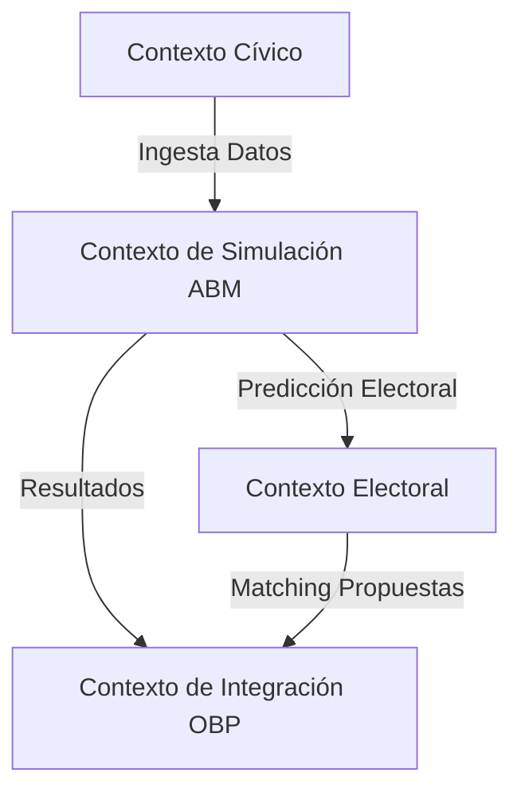

# 🧬 Gobernanza DDD: Modelado de Dominio de CivicPulse

Este manifiesto establece los límites de dominio, lenguajes ubicuos y agregados para el ecosistema de Inteligencia Cívica **CivicPulse / CívicaOS**.

---

## 1. Contextos Acotados (Bounded Contexts)

### A. Contexto Cívico (`CivicContext`)
*   **Propósito**: Modelar la realidad física, socioeconómica y territorial del municipio (Hermosillo).
*   **Conceptos Clave**: Puntos de Dolor (`PainPoint`), Distritos (`District`), Datos Demográficos, Iniciativas.
*   **Privacidad**: Aislado localmente; no expone identificadores únicos de ciudadanos reales.

### B. Contexto de Simulación (`SimulationContext`)
*   **Propósito**: Simular dinámicas de opinión y comportamiento emergente de la población sintética.
*   **Conceptos Clave**: Agentes Sintéticos (`CitizenAgent`), Políticas Públicas (`Policy`), Modelo Deffuant-Weisbuch, Modelo Hegselmann-Krause.
*   **Ejecución**: Orquestado dinámicamente en hardware local (Workstation Tier 2 / Server Tier 3).

### C. Contexto Electoral (`ElectionContext`)
*   **Propósito**: Predecir comportamiento de voto y probabilidades de victoria por candidato/partido.
*   **Conceptos Clave**: Probabilidad Multinomial Logit (MNL Softmax), Perfil Candidato, Encuestas Sintéticas.

### D. Contexto de Integración OBP (`IntegrationContext`)
*   **Propósito**: Traducir recomendaciones cívicas en payloads de negocio para Open Business Plan.
*   **Conceptos Clave**: Payload OBP, Canal Seguro mTLS, Hash de Sesión, Registro de Conformidad Regulatoria.

---

## 2. Modelo de Dominio (Domain Model)

### Entidades (Entities)
*   **`CitizenAgent`**: Agente individual con identidad sintética inmutable, atributos socioeconómicos (ingreso, educación) y vector de opiniones políticas/sociales.
*   **`CivicInitiative`**: Propuesta o problema cívico inicial (ej. Crisis de Agua D8) que inicia la simulación.
*   **`CandidateProfile`**: Atributos, ideología y propuestas del candidato para predicción electoral.

### Objetos de Valor (Value Objects)
*   **`OpinionVector`**: Vector continuo en $\mathbb{R}^n$ (ej. `[0.2, 0.8]`) representando posturas ideológicas. Inmutable.
*   **`GeographicArea`**: Representación geoespacial del distrito electoral (lat/lng, límites de distrito). Inmutable.
*   **`AuditHash`**: Firma criptográfica SHA-256 de auditoría del estado del enjambre.

### Raíces de Agregado (Aggregate Roots)
*   **`DigitalTwin`**: Agrega un conjunto masivo de `CitizenAgent` representando el censo sintético municipal. Controla el motor de simulación.
*   **`AttackPlan`**: Plan de mitigación resultante del análisis, conteniendo el presupuesto estimado, el roadmap de fases cívicas y la auditoría local.

---

## 3. Lenguaje Ubicuo (Ubiquitous Language)

| Término | Contexto | Definición en Dominio |
| :--- | :--- | :--- |
| **Punto de Dolor** | Cívico | Indicador escalar $[0, 1]$ de descontento o gravedad en una dimensión específica (Agua, Seguridad, etc.). |
| **Umbral de Confianza ($\varepsilon$)**| Simulación | Límite de tolerancia en el modelo de Bounded Confidence. Agentes con opiniones distantes a más de $\varepsilon$ no interactúan. |
| **Convergencia ($\mu$)** | Simulación | Velocidad de asimilación de opiniones de un agente hacia otro durante un intercambio social. |
| **Gemelo Digital** | Simulación | Población sintética calibrada con datos demográficos reales de Hermosillo. |
| **mTLS Local** | Integración | Protocolo de transporte TLS mutuo local-first, sin depender de servidores o redes externas para transferir datos a OBP. |
| **Ledger de Auditoría** | Integración | Registro local inmutable de firmas criptográficas para trazabilidad regulatoria. |
